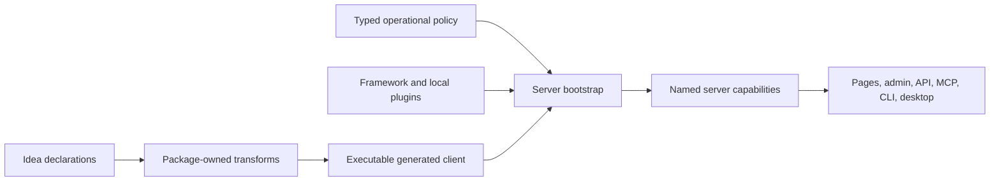

# Stackpress Architecture And Composition

## Core Flow

Idea, config, plugins, and generated state cooperate. The server capability layer
is the shared runtime center; access surfaces remain adapters.

## Foundation Ownership

| Foundation | Native ownership | Stackpress relationship |
| --- | --- | --- |
| `@stackpress/lib` | nested data, statuses, queues, events, routes, files, sessions, terminal primitives | inherited execution vocabulary and public primitives |
| Idea | schema syntax, AST, compilation, `use` composition, transform runner | metadata conventions and package-owned transform discovery |
| Ingest | portable server, plugins, lifecycle/event routing, handler styles, HTTP/WHATWG adapters | framework host and capability bus |
| Inquire | visible SQL builders, dialects, connections, schema diff | generated stores/actions and data operations |
| Reactus | host-routed React SSR, hydration, manifests, Vite build/dev | Stackpress view engine |
| Frui | granular behavior-focused React components | generated and handwritten UI primitives |
| r22n | phrase-keyed React translation | generated and handwritten phrase rendering |

## Lifecycle Ownership

Stackpress assigns conventional meaning to Ingest events:

| Phase | Responsibility |
| --- | --- |
| plugin registration | declare phase listeners and dependency-free state |
| `config` | register services and environment-derived mechanisms |
| `listen` | register reusable operations and generated listeners |
| `route` | register request-facing routes after capabilities exist |
| `idea` | append package-owned transforms before generation |

Normal bootstrap resolves `config`, then `listen`, then `route`. Generation
resolves `idea` before running transforms.

## Package Composition

The aggregate Stackpress plugin registers server, schema, language, CSRF, SQL,
view, session, API, and admin in explicit order. AI and desktop are optional
packages loaded separately when configured.

Current order matters where:

- schema registers the generated-client loader;
- SQL consumes generated models during `listen`;
- admin consumes generated model routes during `route`;
- schema establishes generated files later transforms expand or replace;
- access surfaces expect operational events to exist before calls arrive.

Treat this as current checkout behavior. Do not promise permanent ordering until
a public compatibility policy defines it.

## Event Capability Bus

Named events provide the internal invocation protocol for:

- lifecycle coordination;
- framework operations such as generate, build, push, and serve;
- generated model operations;
- auth, email, webhooks, and application workflows;
- API, MCP, CLI, page, and desktop adaptation;
- plugin contribution registries.

Events share request, response, status, ordering, and cooperative control-flow
semantics. They do not automatically provide caller authorization, a transaction,
or public exposure.

## Architectural Invariants

1. Capability authority precedes interface concerns.
2. Generated runtime output should be owned by its consuming package.
3. Generated source is disposable, but generated runtime state is required.
4. Configuration selects policy while code owns mechanism.
5. Lifecycle and transform order are compatibility-sensitive.
6. Idea metadata is syntactically open and semantically distributed.
7. Every access surface applies its own external contract and security policy.

## Classification Language

When explaining a feature, distinguish whether Stackpress:

- inherits a foundation behavior unchanged;
- adapts it behind a Stackpress-facing boundary;
- coordinates several libraries into a workflow;
- introduces a Stackpress-specific generated or operational contract.

This prevents crediting Stackpress for foundation behavior or describing a
Stackpress convention as a guarantee of the underlying library.

## Detailed Reference

Load [Runtime API Contracts](../references/00004-runtime-api-contracts.md) when
documenting Request, Response, Router, Server, routing overloads, status returns,
or native-resource behavior.

Load [Server And Transport Contracts](../references/00005-server-and-transport-contracts.md)
when documenting terminal bootstrap, plugin discovery, server entrypoints, or
the Node HTTP and WHATWG adapter boundaries.

Load [CLI And Plugin Contracts](../references/00009-cli-and-plugin-contracts.md)
when documenting aggregate package order, lifecycle placement, optional plugin
activation, generated-client bootstrap, or command-to-event composition.
