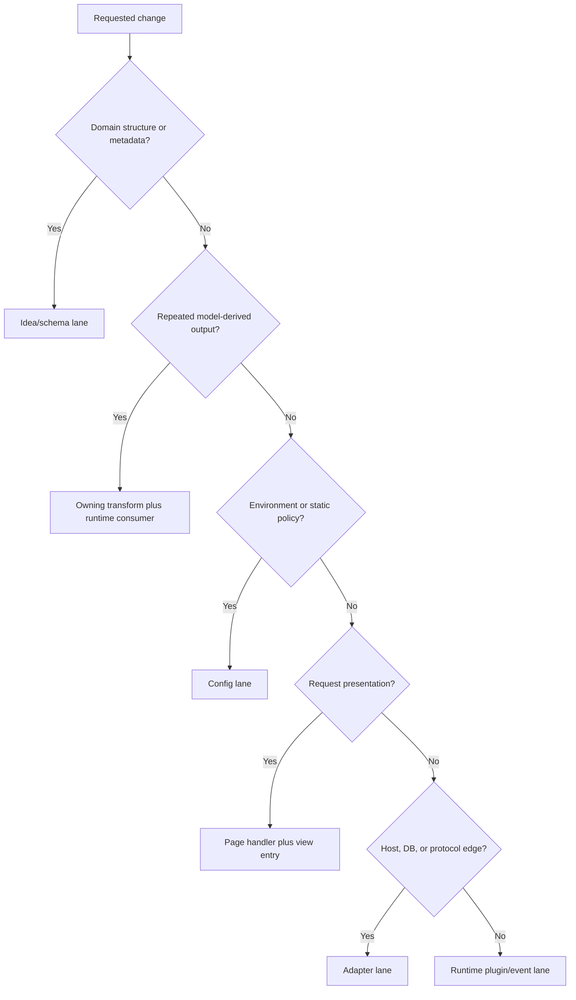

# Stackpress Extension And Contribution

## Ownership-First Routing

Route a change by semantic ownership and runtime consumption, not by the nearest
folder.

Split mixed features across lanes instead of forcing them into one plugin.

## Lane Rules

### Idea/Schema

Use for models, fields, relations, validation, persistence metadata, and
generated-interface metadata. Do not patch runtime code to compensate for a
missing domain declaration.

### Generation

Use when output repeats per model or metadata and runtime depends on emitted
registries, helpers, pages, components, routes, or tools. Change the transform
and runtime consumer as one contract.

### Configuration

Use for static application/environment policy, selected adapters, exposure maps,
brand/locale values, output paths, and config-driven population.

### Runtime Plugin/Event

Use for orchestration, services, side effects, integrations, and custom behavior
that is not naturally model-derived.

### Page/View

Use for custom request presentation. Pair page handlers and route registration
with the selected React view entry and rendering contract.

### Adapter/Foundation

Use narrow adapter packages for host, database, protocol, or native-resource
differences. Change foundation libraries only when the primitive itself owns the
behavior.

## Lifecycle Placement

| Phase | Put here |
| --- | --- |
| plugin registration | dependency-free state and phase listeners |
| `config` | services and environment-derived mechanism setup |
| `listen` | reusable operations and generated listeners |
| `route` | request routes after capabilities exist |
| `idea` | package-owned transforms |
| package contribution event | extensible registry input before initialization |

## Change Procedure

1. State intended behavior and affected callers.
2. Identify semantic owner and whether output is generated.
3. Map producer, generated artifact, runtime consumer, and access surfaces.
4. Select the narrow package and lifecycle phase.
5. Check current versions, exports, adapters, and order dependencies.
6. Implement without making generated output the durable source.
7. Run the smallest convincing proof for every affected contract.
8. Expand verification according to shared behavior and blast radius.
9. Update exports, examples, docs, scaffolds, or skills when their contract moved.

## Verification Matrix

| Change class | Minimum convincing evidence |
| --- | --- |
| Idea/schema | parse/compile and expected normalized schema |
| transform | clean generation, repeat generation, removal/rename behavior |
| generated/runtime pair | generated compile/import and lifecycle registration |
| data | dialect query assertions and transactional workflow proof |
| page/view | route binding, SSR, hydration, interaction, snapshot review |
| access surface | auth, validation, event invocation, status/error mapping |
| adapter | native integration and target-specific test |
| package manifest | build, pack, export, and import verification |
| scaffold/skill | clean copy/install acceptance and current command workflow |
| cross-package | narrow package tests plus affected template/end-to-end path |

Fresh evidence is required after the relevant change. Source presence alone does
not prove generation, wiring, importability, or runtime reachability.

## Contributor Boundaries

- Preserve package responsibilities instead of centralizing feature code in the
  aggregate package.
- Treat lifecycle priority and transform order as compatibility-sensitive.
- Prefer config-driven static seeds over custom population code when no logic is
  required.
- Test generated UI in a browser when behavior, hydration, layout, or
  accessibility is affected.
- Distinguish illustrative skill/scaffold examples from required package names or
  application domains.

No project-wide maintainer map, CODEOWNERS policy, or mandatory public-contract
review gate is an accepted current guarantee.

## Detailed Reference

Load [CLI And Plugin Contracts](../references/00009-cli-and-plugin-contracts.md)
when adding a package plugin, lifecycle listener, generated transform, runtime
command, root CLI behavior, or command-level verification.

Load [Operational Examples](../references/00015-operational-examples.md) for
source-backed end-to-end recipes covering bootstrap, generation/data lifecycle,
database registration, handwritten pages, API/MCP exposure, build, and upgrades.

Load [Interface Exposure Examples](../references/00017-interface-exposure-examples.md)
for focused page/view, API, MCP, and cross-surface adaptation recipes.
