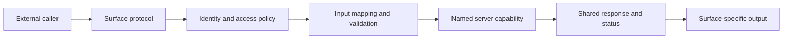

# Stackpress Interfaces And Experience

## Access Surfaces

Stackpress exposes shared server capabilities through multiple adapters:

| Surface | External contract | Access responsibility |
| --- | --- | --- |
| CLI | parsed command and flags | local operator/process policy |
| page/admin | route, request, session, form/CSRF | route and page authorization |
| configured API | HTTP method, path, headers, body | public/app/session identity and scopes |
| OAuth | browser and token flows | application/session records and secrets |
| MCP | tool schemas over stdio, HTTP, or SSE | public/app/user context and scopes |
| desktop | Electron shell, menu, local runtime request | local token and route policy |
| plugin | in-process event call | trusted code or explicit application checks |

Named events are the shared internal invocation protocol. They do not make these
callers equivalent or apply one universal security policy.

## Exposure Models

- Generated model listeners create internal domain capabilities.
- Generated admin routes expose model workflows during `route`.
- Configured API endpoints explicitly map method/path/caller policy to an event.
- MCP can generate model tool definitions, while config selects final visibility,
  overrides, caller type, and transport.
- CLI packages register operational commands as events.
- Desktop packages register optional local commands and contribution events.

Generation supplies candidate integrations; it does not expose every capability
through every surface automatically.

## Surface Adapter Flow

Equivalent operations can legitimately have different identity, validation,
error, and presentation contracts. Direct in-process event resolution has no
automatic caller authorization.

## Host-Routed React

Ingest owns route matching and page action order. A page handler resolves data
and capabilities, selects a React entry, and places response data into the view
pipeline. stackpress-view adapts Reactus as the SSR, asset, build, and hydration
engine.

The view adapter passes a serialized server snapshot containing:

- configured and response data;
- public session details;
- URL fields, headers, request-session data, method, MIME type, and request data;
- normalized response status, errors, results, and totals.

Reactus renders the selected page on the server, embeds the props, and hydrates
the browser with the same snapshot. Client request/response/session wrappers are
readonly helpers over serialized data, not live server objects.

Rendering is skipped for redirects, the configured no-view request flag, or an
existing string body. Development mode can let Reactus/Vite middleware handle
assets and HMR before the response completes.

## Browser Snapshot Boundary

Everything in rendered props is browser-visible and must be intentionally safe
to expose and JSON-serializable. Functions, cyclic structures, native resources,
server secrets, and unnecessary request/session fields do not belong in the
snapshot.

No framework-wide prop allowlist or complete snapshot escaping policy is an
accepted current guarantee. Security-sensitive applications should minimize
forwarded fields and test hostile values, SSR output, and hydration.

## UI And Localization Ownership

- stackpress-view generates role-specific form/filter/list/span/view wrappers;
- stackpress-admin composes generated CRUD pages and routes;
- Frui supplies generic behavior-focused React components, not application
  layout/theme/brand policy;
- r22n translates source phrases and preserves React nodes in interpolation;
- Stackpress config and language/session packages choose locale and caller state;
- Reactus owns rendering/build mechanics, not application routes or domain data.

Generated wording is part of the translation contract. Generated structure does
not replace rendered accessibility and interaction verification.

## Cross-Surface Risks

- access policy can diverge between page, API, and MCP mappings;
- nested event calls can lose caller context unless intentionally propagated;
- validation and errors can map differently by protocol;
- generated definitions and configured exposure can drift;
- audit identity and tracing are not automatically centralized.

## Detailed Reference

Load [Runtime API Contracts](../references/00004-runtime-api-contracts.md) when
an interface document needs exact request, response, routing, server, or status
contracts.

Load [Stackpress Configuration Catalog](../references/00008-configuration-catalog.md)
for view, brand, language, session/auth, API, admin, cookie, CSRF, MCP, and
desktop policy that shapes external experiences.

Load [View API Contracts](../references/00012-view-api-contracts.md) for Reactus
SSR/build behavior, view lifecycle, serialized browser props, hooks/providers,
layouts, notifications, aggregate admin helpers, or `setViewProps`.

Load [Session And Language Contracts](../references/00013-session-language-contracts.md)
for JWT/session lifecycle, permission matching, global route authorization,
auth actions, locale selection/persistence, or r22n browser translation.

Load [Interface Exposure Examples](../references/00017-interface-exposure-examples.md)
when adapting one event into a handwritten page, configured API endpoint, MCP
tool, or cross-surface policy comparison.
