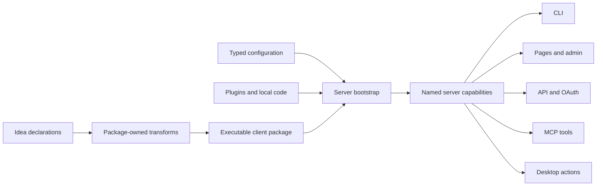
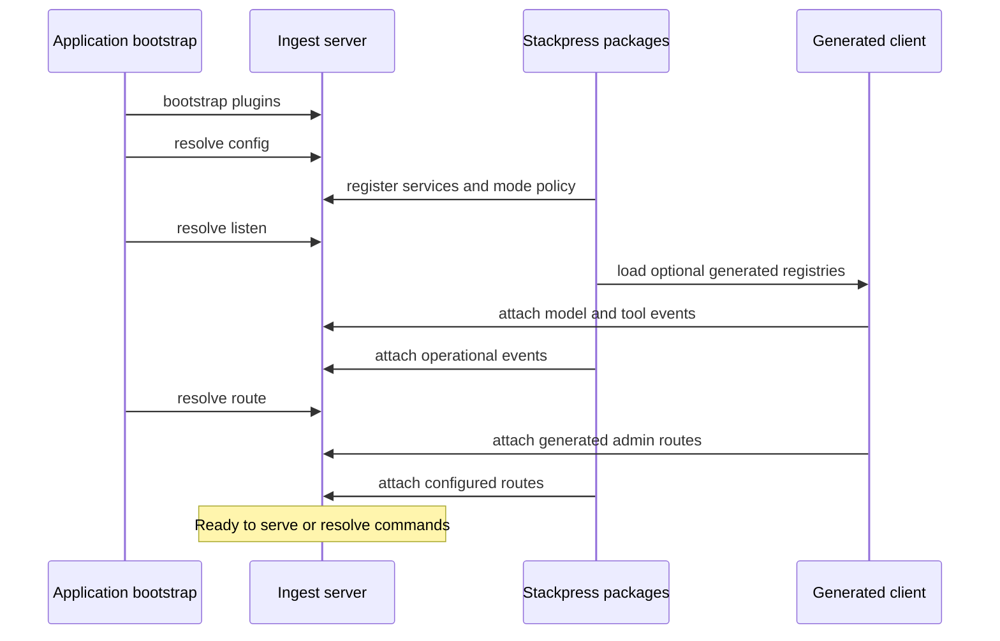
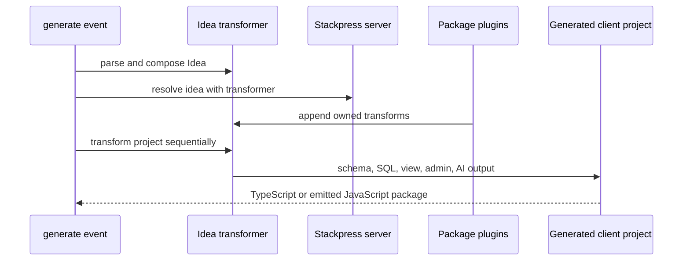

# Core Architecture Investigation

## Status And Scope

Phase 5 P0 synthesis for TOP-001 through TOP-005. This record joins the five
topics into one operating model. It is source-backed research, not promoted KB
truth or approved public positioning.

## Canonical Technical Thesis

Stackpress is a server-capability composition framework. An Idea schema carries
declarations and open metadata. Package-owned transforms compile those
declarations into an executable client package. During server bootstrap,
lifecycle events let packages install services, capabilities, and routes. Named
events then provide the stable internal call shape used by terminal commands,
pages, APIs, MCP tools, desktop actions, and other plugins.

This thesis is narrower and more defensible than "one model creates everything":

- the model supplies reusable domain intent and metadata;
- configuration selects application and environment policy;
- plugins supply mechanisms, generators, and custom behavior;
- generated code implements contracts expected by runtime packages;
- events expose capabilities to multiple access surfaces.

## Causal Chain

## Contract Layers

| Layer | Owns | Does not own |
| --- | --- | --- |
| Idea language | declarations, imports, open attributes, transform plugin list | Stackpress meanings for every attribute |
| Stackpress schema model | normalized model, column, relation, component, store, and documentation views | SQL execution or rendered interfaces |
| Generator packages | emitted code required by their runtime consumers | unrelated package output |
| Generated client | executable registries and model-specific runtime units | application bootstrap policy |
| Lifecycle events | ordered installation opportunities | domain-level authorization by themselves |
| Operational events | reusable capability invocation and response flow | transport-specific contracts |
| Access surfaces | authentication, protocol mapping, presentation, external errors | duplicate domain implementation |

## Bootstrap And Runtime Timeline

## Generation Timeline

## Architectural Invariants

1. Server capability authority precedes transport or interface concerns.
2. A package that consumes a generated runtime contract should own its transform.
3. Generated output is disposable source but required executable state.
4. Lifecycle registration order is observable and therefore contractual where
   later packages consume services or generated registries from earlier ones.
5. Event reuse does not imply universal exposure; each access surface must apply
   its own authentication, authorization, validation, and protocol policy.
6. Idea metadata is open syntax with distributed semantic ownership.
7. Configuration chooses policy while plugins and generated code own mechanism.

## Deliberate Tradeoffs

- Generation concentrates repetitive integration logic but introduces stale
  output and package-version compatibility risks.
- Events decouple callers from implementations but make naming, collision,
  authorization, and observability governance necessary.
- Open metadata enables extension without parser changes but requires namespace
  ownership and fallback rules outside the language core.
- Package lifecycle boundaries preserve modularity but make aggregate ordering
  and phase invariants important contributor knowledge.
- Shared capabilities reduce duplicated domain logic, while surface adapters
  still require independent security decisions.

## Language Dispositions

Recommended technical language:

- "server-capability composition framework"
- "generated client package"
- "package-owned generation"
- "lifecycle-owned registration"
- "event capability bus"
- "configuration selects policy; plugins own mechanism"

Hold for founder approval:

- claims that Stackpress should be positioned more broadly than a CMS;
- "one model, many interfaces," because config and plugins are also causal;
- "product contract," because Idea alone does not own application behavior.

Reject as misleading:

- "operations console" for configuration;
- "the schema generates the whole application";
- "events automatically secure every interface."

## Evidence Anchors

- `packages/stackpress/src/plugin.ts`
- `packages/stackpress-server/src/Terminal.ts`
- `packages/stackpress-schema/src/scripts/generate.ts`
- `packages/stackpress-{schema,sql,view,admin,ai}/src/plugin.ts`
- `packages/stackpress-{schema,sql,view,admin,ai}/src/transform/`
- `templates/blog/config/` and `templates/blog/schema.idea`

## Remaining Decisions

- Which technical thesis should become founder-approved public positioning?
- Which lifecycle and event names are guaranteed public contracts?
- What version metadata should prove generated-client/runtime compatibility?
- What namespace policy should govern attributes and operational events?

