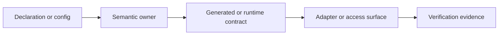
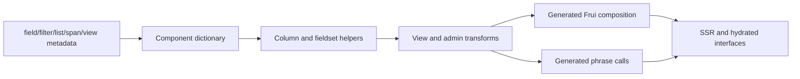

# Extension And Maintenance Investigation

## Status And Scope

Final Phase 5 synthesis for TOP-011 through TOP-014. This record connects UI
metadata, explicit adapters, compatibility boundaries, and contributor routing.
It is research, not promoted context truth.

## Final Technical Model

Stackpress is a server-capability composition framework whose extension model is
distributed across declarations, package-owned semantics, lifecycle plugins,
generated runtime contracts, explicit adapters, and access surfaces.

Its maintenance unit is therefore not a file or package in isolation. It is a
contract chain:

A safe change identifies every affected link, changes the narrowest owner, and
verifies both production and consumption of the contract.

## Extension Layers

| Layer | Extension mechanism | Compatibility-sensitive output |
| --- | --- | --- |
| Idea | `use`, attributes, plugin entries | compiled schema and metadata |
| Schema | dictionaries and helper object model | normalized semantic interpretation |
| Generation | package-owned transforms | client files, imports, exports, tests |
| Runtime | lifecycle plugins and named events | services, listeners, routes, statuses |
| Data | dialect and connection adapters | SQL and transaction behavior |
| View | component definitions and Reactus entries | SSR/hydration modules and phrases |
| Access | API, MCP, page, CLI, desktop adapters | caller contracts and authorization |
| Workflow | scaffolds and skills | contributor sequencing and evidence gates |

## Generated UI Loop

## Portability Principle

Portability is produced by explicit edge adapters while preserving native
resources and narrow cores. It is not a promise that every combination of host,
database, view mode, transport, and package is equally implemented or tested.

## Compatibility Principle

Generated output converts many source-level details into runtime dependencies:
metadata names, transform order, package exports, component imports, phrase
text, schema revisions, config paths, and adapter APIs. These should be treated
as versioned contracts even where current manifests do not declare them.

## Contributor Principle

Route changes by semantic ownership and runtime consumption:

1. domain structure or metadata belongs in Idea;
2. repeated model-derived output belongs in an owning transform/runtime pair;
3. application orchestration belongs in runtime plugins and events;
4. custom request presentation belongs in page/view pairs;
5. environment selection belongs in config;
6. transport or database differences belong in adapters;
7. fixes to primitives remain in their foundation library.

## Phase 5 Canonical Claims

The source supports these technical claims:

- Stackpress centers reusable server capabilities, not one interface.
- Idea carries open metadata whose semantics are distributed to owning packages.
- The generated client is executable application state.
- Lifecycle phases are package installation and ownership boundaries.
- Events are the internal capability protocol, with surface-specific security.
- Revisions preserve schema history but do not prove database applied state.
- Reactus hydrates from a browser-visible serialized server snapshot.
- Configuration is executable operational policy.
- Reuse and distribution include code, schema, generated contracts, scaffolds,
  and agent workflows.
- Portability, compatibility, and contribution safety depend on explicit
  boundaries and evidence, not abstraction claims alone.

## Final Research Gaps

- founder-approved public positioning and vocabulary;
- formal event and metadata namespace governance;
- generated-client/runtime compatibility metadata;
- database applied-state and rollback authority;
- browser snapshot exposure and escaping policy;
- config runtime validation and provenance;
- cross-surface authorization and audit descriptors;
- supported adapter matrix and release testing policy;
- maintainer ownership and review gates.

These gaps are taxonomy and governance inputs. They do not invalidate the
technical model, but the KB must label them as unresolved rather than invent
guarantees.

## Phase 6 Readiness

All fourteen deeper topics now have a first deep pass. Phase 6 can derive a
retrieval-oriented context taxonomy from accepted technical concepts, keep open
governance questions in spec records, and validate the promoted KB against the
artifact tests in GAP-003.

