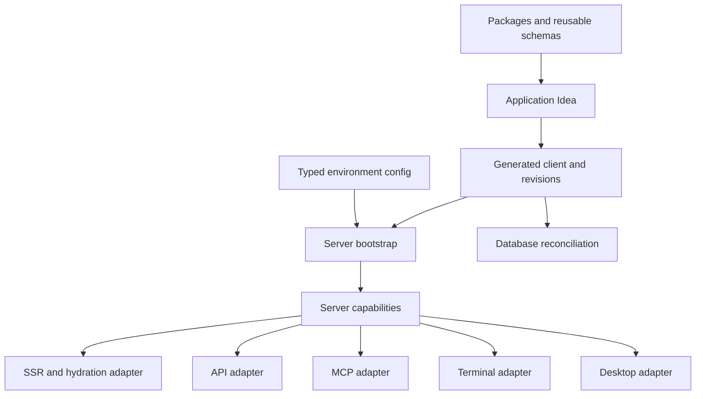

# Operational Workflow Investigation

## Status And Scope

Phase 5 synthesis for TOP-006 through TOP-010. This record tests the P0
capability model against database, rendering, configuration, access, and
distribution workflows. It is research, not promoted context truth.

## Operational Thesis

Stackpress turns reusable declarations and package mechanisms into an
application by reconciling several independently owned forms of state:

- Idea and generated-client state;
- database schema and data state;
- server and environment policy;
- server-rendered and hydrated browser state;
- caller identity and access-surface policy;
- installed package, schema, plugin, scaffold, and skill versions.

The event capability bus coordinates these forms of state, but it does not make
their safety, authorization, or compatibility rules identical.

## Workflow Map

## Five Operational Contracts

| Topic | Contract | Principal boundary |
| --- | --- | --- |
| Data reconciliation | revision history is compared or materialized through Inquire | history is not applied-state tracking |
| Host-routed React | server selects entry and serializable snapshot; Reactus renders/hydrates | browser state is a snapshot, not live server authority |
| Configuration policy | executable typed modules assemble environment choices | compile-time types are not universal runtime validation |
| Access adapters | each surface maps callers to named events | event reuse does not reuse all security policy |
| Package-style reuse | schemas, plugins, exports, scaffolds, and skills distribute different contracts | package compatibility remains multi-dimensional |

## End-To-End Application Loop

1. Install framework and domain packages.
2. Compose package and local schemas through Idea `use`.
3. Assemble a bootstrap module from shared and environment-specific config.
4. Bootstrap plugins and discover package-owned transforms.
5. Generate the executable client and append schema revisions.
6. Reconcile the target database with `install`, `push`, or migration files.
7. Bootstrap runtime services, model listeners, and routes.
8. Resolve capabilities through CLI, pages, API, MCP, desktop, or plugins.
9. For rendered pages, serialize a bounded server snapshot for Reactus hydration.
10. Regenerate and reconcile when declarations or generated contracts change.

## Operational Invariants

1. Generation precedes operations that require the generated client.
2. Database revision files represent generated schema history, not confirmed
   deployment or migration execution.
3. Environment config must be loaded before lifecycle consumers read policy.
4. Request-facing surfaces own caller authentication and protocol mapping even
   when they invoke the same event.
5. Hydration props must be serializable and safe to expose to the browser.
6. Package reuse can carry syntax, runtime behavior, generation behavior, UI,
   workflows, or all of them; documentation must name which contract is shipped.
7. Root bootstrap distribution and application runtime distribution are separate
   execution modes with different dependency assumptions.

## Confirmations And Revisions To P0

Confirmed:

- server capabilities remain the common runtime center;
- configuration selects policy while packages own mechanisms;
- access surfaces adapt capabilities rather than form one universal interface;
- generated code is executable state used by data, view, admin, and AI flows.

Revised:

- "shared capability" must not imply shared authorization or transaction policy;
- "generated client lifecycle" includes schema-history production, but database
  applied state is not tracked by the same mechanism;
- configuration is both policy and executable composition code, not a passive
  settings document;
- package distribution includes human/agent workflows as well as runtime code.

## Cross-Cutting Risks

- schema history can diverge from actual database state;
- generated props can expose server data or fail JSON serialization;
- environment modules can drift without runtime validation or comparison;
- API, page, MCP, CLI, and desktop controls can become inconsistent;
- package exports, generated imports, schemas, plugins, and skills can version
  independently without a shared compatibility declaration.

## Evidence Anchors

- `packages/stackpress-{schema,sql,view,api,ai,session,desktop}/src/`
- `templates/blog/config/`, `templates/blog/plugins/`, `templates/blog/schema.idea`
- `packages/*/package.json`, package `.idea` files, and `bin/stackpress.mjs`
- sibling Inquire, Reactus, Idea, and Ingest source
- `skills/`

## Remaining Decisions

- What should identify database applied state and rollback policy?
- What is the approved browser-prop exposure and serialization contract?
- Should config receive runtime schemas, layering rules, and drift checks?
- Should access surfaces share a central authorization descriptor?
- What compatibility metadata and discovery system should packages publish?

