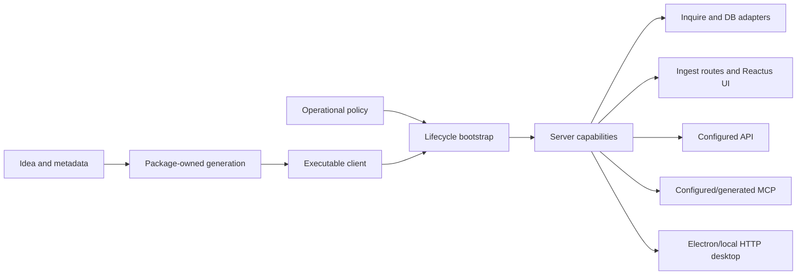

# Phase 6 Context-Only Validation

## Method

After promotion, repeat the six artifact tests using only `.agents/context/`.
Research ledgers and Phase 5/6 synthesis files are excluded from the test input.

## CTX-VAL-001: Documentation

Prompt: Explain how Stackpress generation becomes live runtime behavior.

Context used: modeling/generation, architecture/composition, compatibility.

Context-only answer structure:

1. Idea composes declarations and open metadata.
2. `idea` lets enabled packages append owned transforms.
3. Sequential transforms emit one executable generated client.
4. The configured client service imports that package.
5. SQL, admin, and AI consume generated registries during lifecycle phases.
6. Regeneration, package exports, order, and versions form compatibility
   boundaries.

Verdict: Pass. The mechanism and caveats are independently retrievable.

## CTX-VAL-002: Article

Prompt: Why does Stackpress use events as the center of application composition?

Context used: identity/principles, architecture/composition, runtime/operations,
interfaces/experience.

Context-only thesis:

> Stackpress uses named events as an internal capability protocol so terminal,
> page, API, MCP, desktop, and plugin callers can share server behavior without
> sharing one external protocol or security model.

Supporting sections: lifecycle versus operational events; ordered status flow;
surface-specific policy; naming and compatibility tradeoffs.

Verdict: Pass. The article can explain both benefit and governance cost.

## CTX-VAL-003: Diagram

Prompt: Diagram Idea through database, rendered UI, API, MCP, and desktop.

Context used: architecture, modeling, runtime, interfaces, ecosystem.

Verdict: Pass. Ownership and adapter boundaries remain visible.

## CTX-VAL-004: Teaching

Prompt: Teach a developer to add a model-driven feature safely.

Context used: identity, modeling, runtime, contribution.

Context-only lesson:

1. Model domain structure and relevant UI/persistence metadata in Idea.
2. Generate and inspect the client rather than editing it as source.
3. Route remaining work to config, runtime, generation, or page/view lanes.
4. Reconcile local data with the correct destructive-operation awareness.
5. Verify parse, generation, imports, lifecycle registration, and affected
   rendered/runtime behavior.

Verdict: Pass. The KB supports sequencing and mental models without a fixed app.

## CTX-VAL-005: Marketing

Prompt: Produce truthful differentiator messages.

Context used: identity, architecture, ecosystem, compatibility.

Safe context-only message foundations:

- Build server capabilities once, then adapt them for controlled human, system,
  AI, and local-tool interfaces.
- Turn model intent into inspectable generated code that returns to runtime.
- Compose focused open-source libraries without hiding SQL, React, server, and
  native adapter boundaries.
- Extend through schemas, lifecycle plugins, generated contracts, and local code.

Required restraint: do not choose a final category/tagline, promise zero code,
claim universal portability, or imply automatic exposure/security.

Verdict: Conditional pass. The KB generates defensible message territory while
correctly preserving founder positioning as unresolved.

## CTX-VAL-006: Contributor Onboarding

Prompt: Help a volunteer locate and verify a change.

Context used: extension/contribution, architecture, compatibility, plus one
task-specific domain file.

Context-only instruction:

1. Identify semantic owner and affected callers.
2. Trace producer, generated artifact, runtime consumer, lifecycle, and surface.
3. Change the narrow owner rather than generated output or the aggregate package.
4. Compare current dependency, export, adapter, and order contracts.
5. Run the minimum proof from the verification matrix and affected integration.

Verdict: Pass. Formal maintainer ownership is correctly identified as absent.

## Final Result

All six artifact families are supportable from context alone. Marketing remains
intentionally conditional on founder-approved category and message priority.

GAP-003: Resolved for technical KB robustness.

No output-specific context file is needed. The eight-file taxonomy is retained.

