# Phase 7 Maintenance System

## Purpose

Keep the promoted Stackpress KB aligned with source and accepted product intent
without turning every code edit into a full research replay.

The durable procedure is
[Stackpress KB Maintenance Workflow](../../workflows/stackpress-kb-maintenance.md).

## Maintenance Model

```mermaid
flowchart LR
  CHANGE["Source or decision change"] --> TRIGGER["Contract trigger test"]
  TRIGGER --> IMPACT["Context impact map"]
  IMPACT --> EVIDENCE["Narrow authority and evidence review"]
  EVIDENCE --> CLASSIFY["Unchanged, update, conflict, demote, proposal"]
  CLASSIFY --> CONTEXT["Context update or spec routing"]
  CONTEXT --> PROOF["Contract proof and artifact regressions"]
  PROOF --> VALIDATE["Agent Workspace validation"]
```

## Trigger Classes

| Class | Examples | Response |
| --- | --- | --- |
| semantic | Idea grammar, attributes, helpers, package ownership | review modeling plus consumers |
| generated | transform/output/export/order changes | review producer/runtime/compatibility chain |
| operational | lifecycle, event, config, data command changes | review runtime and affected surfaces |
| adapter | host, DB connector, Reactus, MCP, desktop changes | revise evidence/support labels |
| distribution | manifests, versions, schemas, scaffold, skills | review ecosystem and contribution contracts |
| product language | founder category, promise, terminology | founder authority and identity review |
| governance | accepted support, namespace, security, release policy | promote only implemented/accepted truth |
| taxonomy | context ownership, split, merge, routing | all context and artifact tests |

## Refresh Depth

### Narrow Refresh

Use when one contract and at most two context domains change. Inspect owning
source/tests, update affected context, run the narrow contract proof and selected
artifact regressions.

### Broad Refresh

Use when architecture, taxonomy, aggregate ordering, generated-client shape, or
more than two context domains change. Recheck the full contract chain and run all
six artifact tests.

### No-Change Review

When a refactor preserves promoted behavior, no context edit is required. Report
the unchanged determination only when the task needs a durable audit trail.

## Promotion And Demotion

Promote only accepted reusable behavior, constraints, decisions, terms, and
verified boundaries. Keep tasks, raw evidence, speculative systems, and temporary
assumptions in specs or references.

Demote when context becomes stale, contradicted, too narrow, or no longer
reusable. Preserve useful history outside context and update the router when
ownership changes.

## Artifact Regression Policy

The maintenance workflow maps each context domain to affected documentation,
article, diagram, teaching, marketing, and contributor tests. Run all six when:

- the router or taxonomy changes;
- a canonical architecture principle changes;
- public identity language changes;
- three or more context domains change;
- a narrow test exposes a routing or coverage gap.

## Cadence

Maintenance is trigger-based. A periodic audit is useful before a release or
major documentation/marketing cycle, but calendar time alone does not alter
truth. Release audits should compare manifests, installed versions, generated
output, active adapters, context boundaries, and public wording.

## Ownership

- Maintainers of the changed code own technical evidence.
- Founder/user decisions own category and public positioning.
- The agent performing maintenance owns impact mapping, truthful labels,
  retrieval regression, and deterministic validation.
- Formal CODEOWNERS and mandatory public-contract review gates are not currently
  established by this KB.

## Phase Result

The promoted KB now has a routed, repeatable maintenance workflow. It separates
narrow updates from broad refreshes, preserves source authority boundaries, and
prevents proposed governance from entering context as implemented behavior.

