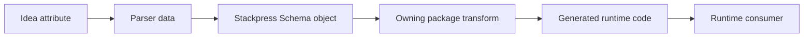

# TOP-002: Idea Metadata And Semantic Ownership

## Finding

Idea owns a composable declaration language and an open metadata channel.
Stackpress-schema normalizes that output into a rich object model. SQL, view,
admin, AI, and other packages interpret the portions required by their runtime
contracts. No single parser layer owns every Stackpress meaning.

## Semantic Ownership Matrix

| Concern | Primary owner | Consumers |
| --- | --- | --- |
| Grammar, values, imports, plugin declarations | Idea parser/compiler | all transforms |
| Transform sequencing and plugin invocation | Idea transformer | generator packages |
| Model, fieldset, column object model | stackpress-schema | SQL, view, admin, AI |
| Assertions, serialization, documentation metadata | stackpress-schema | generated schema, SQL, tools |
| Persistence, keys, relations, search behavior | stackpress-schema store extensions and stackpress-sql | admin, API, MCP |
| Form, filter, list, span, view components | stackpress-schema component extensions and stackpress-view | admin and custom views |
| Admin routes and workflows | stackpress-admin | admin users |
| MCP tool contracts and defaults | stackpress-ai | MCP transports and callers |

## Attribute Lifecycle

An attribute is therefore not fully documented by its grammar. Complete
documentation must name its accepted syntax, semantic owner, generated effect,
runtime consumer, fallback, and compatibility expectations.

## Namespace Rules Derived From Source

- Names such as `field`, `filter`, `list`, and `view` identify distinct UI roles.
- Store and relation metadata affect persistence and generated actions.
- `description` and `examples` are reused for generated documentation and tool
  contracts, so prose metadata can become operational interface metadata.
- Plugin transform entries are package paths, making extension package-oriented.

No explicit global collision policy or stable namespace registry was found.
That absence is a governance gap, not permission to claim all names are public.

## Extension Guidance

1. Add semantics in the package that owns the resulting runtime behavior.
2. Preserve open Idea data unless normalization is required for shared use.
3. Expose a schema helper when multiple transforms need the same interpretation.
4. Generate runtime code in the consuming package's transform.
5. Test both metadata interpretation and emitted runtime behavior.
6. Document fallback and omission behavior, not only the happy path.

## Canonical Explanation

Idea describes structure and carries extensible metadata. Stackpress packages
give that metadata operational meaning, allowing new capabilities to be added
without turning the language parser into a framework-wide policy engine.

## Evidence Anchors

- sibling Idea parser, compiler, transformer, and `use` implementation
- `packages/stackpress-schema/src/Schema.ts`
- `packages/stackpress-schema/src/Column.ts`
- `packages/stackpress-schema/src/model/` and `src/column/`
- `packages/stackpress-{sql,view,admin,ai}/src/transform/`
- `templates/blog/schema.idea`

## Resolution

Evidence strength: strong. Adopt distributed semantic ownership as the canonical
technical model. Defer a formal namespace registry and public-stability policy.

