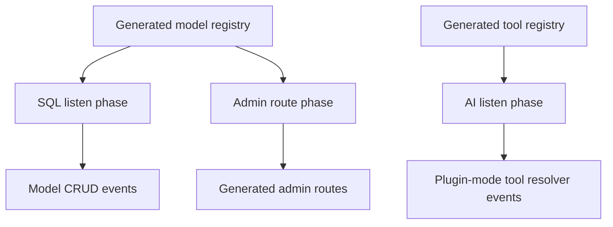

# TOP-003: Generated Client Lifecycle Contract

## Finding

The generated client is an executable application package, not a collection of
passive types. It carries normalized configuration, schema classes, stores,
actions, event listeners, UI components, admin routes, scripts, and tool
registries that runtime packages load during bootstrap.

## Lifecycle

| Stage | Contract |
| --- | --- |
| Compose | Idea resolves imported schemas and declared transforms. |
| Discover | Stackpress resolves `idea`; enabled packages append transforms. |
| Generate | Transforms run sequentially against one ts-morph project. |
| Emit | Project becomes TypeScript or JavaScript plus declarations. |
| Load | `client` service imports the configured module, optionally nullable. |
| Register | SQL, admin, and AI consume generated model/tool registries. |
| Operate | Events, stores, routes, components, and tools serve live workflows. |
| Reconcile | Regeneration updates output after Idea or package-contract changes. |

## Package Mutation Is Intentional

Transforms cooperate on shared files. Schema creates the base index and package;
SQL replaces and expands the index; view and admin add exports; AI patches the
index and package exports. Sequential mutation is therefore part of the current
contract, not incidental file churn.

Consequences:

- transform ordering matters;
- transforms must be repeatable and avoid duplicate exports;
- stale files must be pruned when declarations disappear;
- a package must understand what earlier transforms establish;
- generated package tests are part of the emitted contract.

## Runtime Registration

## Current Safety Mechanisms

- nullable client loading permits pre-generation commands to bootstrap;
- schema generation prunes stale model and fieldset output;
- AI checks imports/exports before patching shared files;
- generated package manifests declare granular exports;
- generated tests cover schema, stores, actions, and events;
- schema revisions can preserve historical model state for data reconciliation.

## Missing Explicit Guarantees

- no generated/runtime version handshake was found;
- no universal stale-client check runs at bootstrap;
- no declared transform dependency graph replaces sequence order;
- compatibility across Idea, generated package, and runtime package versions is
  convention-based;
- application-local edits inside generated directories have no protection.

## Contributor Contract

Change the transform and runtime consumer together. Verify clean generation,
repeat generation, removal/rename behavior, package exports, compilation, and the
runtime phase that imports the generated unit. Do not treat generated source as
the durable implementation owner.

## Canonical Explanation

Stackpress compiles application declarations into a loadable client package.
That package closes the loop between design-time metadata and runtime behavior by
registering model-specific capabilities and interfaces during server bootstrap.

## Evidence Anchors

- `packages/stackpress-schema/src/scripts/generate.ts`
- `packages/stackpress-schema/src/plugin.ts`
- `packages/stackpress-{schema,sql,view,admin,ai}/src/transform/`
- `packages/stackpress-{sql,admin,ai}/src/plugin.ts`
- `templates/blog/client_source/`

## Resolution

Evidence strength: strong. Adopt "executable generated client package." Carry
version handshake, stale detection, and transform dependencies into TOP-013.

