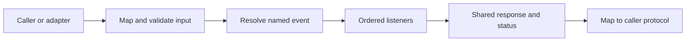

# TOP-005: Event Capability Bus And Governance

## Finding

Stackpress extends Ingest's event emitter into a capability bus. Named events
connect lifecycle coordination, operational commands, generated model actions,
application workflows, integrations, and access-surface adapters.

## Event Classes

| Class | Examples | Intended callers |
| --- | --- | --- |
| Bootstrap lifecycle | `config`, `listen`, `route` | application bootstrap |
| Generation contribution | `idea` | generate workflow and generator packages |
| Framework operations | `generate`, `build`, `push`, `migrate`, `serve` | CLI, tests, orchestration |
| Generated model operations | `<model>-create`, `-search`, `-update` | pages, APIs, MCP, plugins |
| Application/domain events | auth, authorization, email, custom workflows | other capabilities and surfaces |
| Surface/transport events | MCP transports, desktop commands | CLI or hosting adapter |
| Contribution events | desktop config/menu, plugin tool resolvers | extension packages |
| Error handling | `error` | terminal/server failure pipeline |

## Call Flow

## Governance Boundaries Found In Source

- Generated model names create predictable event prefixes and operation suffixes.
- Regex listeners are possible and are used for strict desktop commands.
- Listener priority/order can affect behavior.
- API and MCP exposure are explicit configuration mappings, not automatic export
  of every event.
- MCP validates tool input and applies caller-specific visibility/authorization.
- Session/page handlers commonly resolve authorization events before operations.
- Responses and status codes provide shared control flow across adapters.

## Governance Gaps

No central registry was found that declares:

- owner, visibility, stability, or deprecation status for every event;
- canonical input/output schemas for arbitrary events;
- collision prevention across packages;
- mandatory authorization policy by event;
- tracing and audit requirements across nested resolves;
- transaction semantics for multi-event workflows.

These are limits of current evidence, not claims that controls are absent from
every application.

## Recommended Event Contract Record

Future public or cross-package events should document:

| Field | Meaning |
| --- | --- |
| Name and owner | collision and maintenance authority |
| Class and visibility | lifecycle, internal, plugin, application, or public |
| Input contract | required data, request/session dependencies |
| Result contract | response results, status codes, errors |
| Authorization | caller identity and policy checks |
| Side effects | data, files, network, generated state |
| Idempotency/transaction | retry and composition behavior |
| Observability | logs, audit events, correlation |
| Stability | version, deprecation, replacement |

## Canonical Explanation

Named events are Stackpress's internal capability protocol. They allow many
interfaces to call shared server behavior, while each interface remains
responsible for deciding what is exposed and how callers are controlled.

## Evidence Anchors

- sibling `@stackpress/lib` emitter and queue implementations
- sibling Ingest `Server`, `Router`, and response lifecycle
- `packages/stackpress-server/src/Terminal.ts`
- `packages/stackpress-sql/src/transform/events/`
- `packages/stackpress-api/src/plugin.ts`
- `packages/stackpress-ai/src/plugin.ts` and `src/helpers.ts`
- `packages/stackpress-session/src/session/pages/`
- `packages/stackpress-desktop/src/plugin.ts`

## Resolution

Evidence strength: strong for the capability-bus model and explicit exposure.
Event catalog, stability, collision, observability, and transaction policy remain
governance work rather than established framework guarantees.

