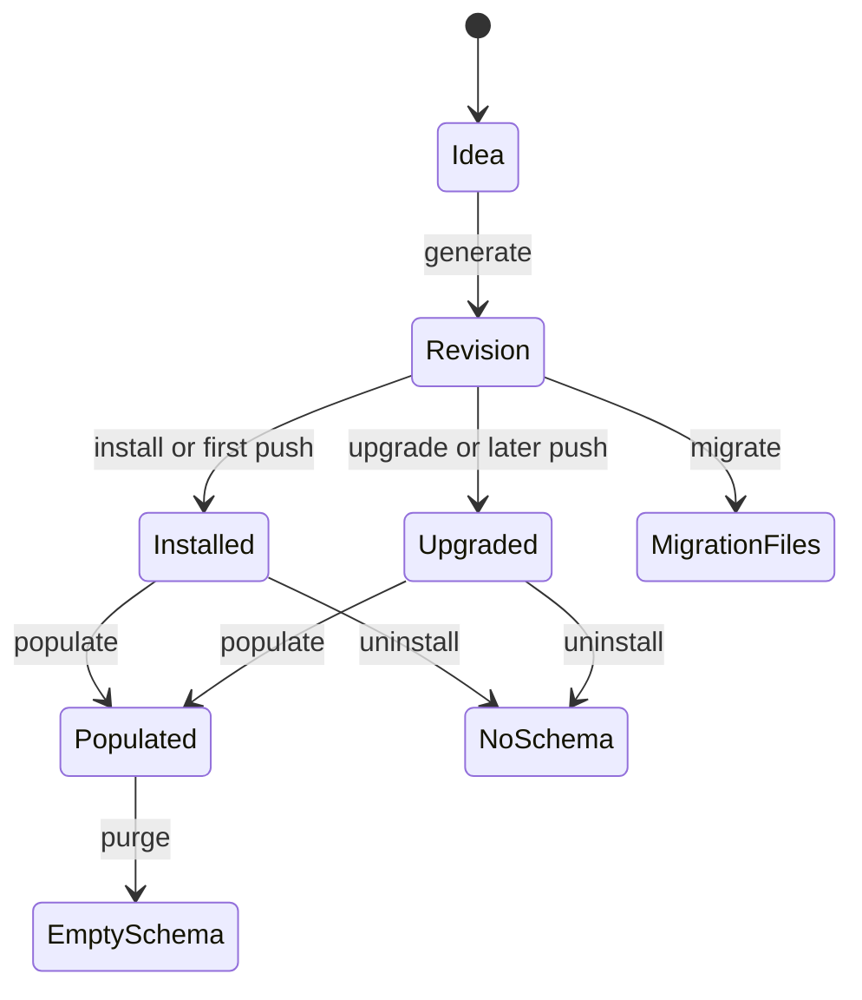

# TOP-006: Data Reconciliation Lifecycle

## Finding

Stackpress adds an operational data lifecycle above Inquire. Generation records
timestamped schema snapshots. SQL commands turn generated stores and adjacent
schema revisions into live queries or SQL files. Inquire remains responsible for
query building, dialect behavior, connections, and transactions.

## State Types

| State | Authority | Purpose |
| --- | --- | --- |
| Idea source | application source | intended domain declaration |
| Generated schema config | generated client | normalized current schema |
| Revision JSON | configured revision directory | historical generated schemas |
| Migration SQL | configured migration directory | reviewable history-derived SQL |
| Database schema | selected database connection | actual live storage shape |
| Population config | bootstrap config | ordered seed capability calls |

Revision history does not record which database received which change. Migration
files are generated artifacts and are not executed by `migrate`.

## Command Semantics

| Command | Behavior | Safety boundary |
| --- | --- | --- |
| `generate` | emits client and inserts changed schema revision | no database mutation |
| `install` | drops generated tables, recreates them, seeds first revision if absent | destructive by design |
| `push` | installs without two revisions; otherwise upgrades newest adjacent pair | assumes database aligns with expected history |
| `upgrade` | executes adjacent diff in one transaction | clear renames preserved; ambiguous renames fail unless forced |
| `migrate` | writes SQL across revision history | does not update database or track application |
| `populate` | resolves configured events sequentially | event behavior owns validation/idempotency |
| `purge` | truncates generated stores in a transaction | data-destructive, schema-preserving |
| `uninstall` | drops generated stores | destructive |

## Transition Model

## Rename And Destructive-Change Policy

- A one-to-one removed/added field pair with matching structural semantics is
  planned as a column rename.
- Index, uniqueness, primary-key, relation, nullability, and default semantics
  participate in matching.
- Multiple same-shape candidates are considered ambiguous and fail before SQL.
- `--force` on live upgrade bypasses rename preservation and accepts generic
  destructive diff behavior.
- Migration generation refuses ambiguous rename output; it has no force path in
  the inspected script.

## Transaction Boundaries

`install`, `upgrade`, and `purge` execute their query sequences inside database
transactions. `populate` resolves separate events sequentially without wrapping
the whole population plan in one transaction. Generated migration files have no
runtime transaction or rollback contract by themselves.

## Operator Guidance

1. Generate before reconciling.
2. Review revision and migration output for production changes.
3. Do not treat revision count as proof of live database state.
4. Use `install`, `purge`, and `uninstall` only with explicit data-loss intent.
5. Treat `--force` as acceptance of destructive diff behavior.
6. Design population events for rerun behavior or explicitly document one-shot
   expectations.

## Evidence Anchors

- `packages/stackpress-schema/src/Revisions.ts`
- `packages/stackpress-schema/src/transform/config.ts`
- `packages/stackpress-sql/src/scripts/`
- `packages/stackpress-sql/src/helpers.ts`
- `packages/stackpress-sql/tests/upgrade.test.ts`
- sibling Inquire `Engine`, dialect, diff, and transaction source

## Resolution

Evidence strength: strong. Adopt "schema-history reconciliation" rather than a
full migration-management claim. Carry applied-state, rollback, and dialect test
matrix questions into TOP-012 and TOP-013.

