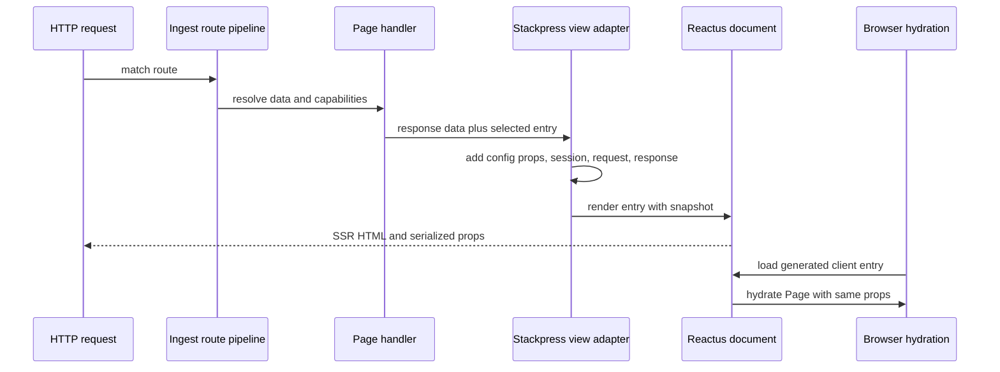

# TOP-007: Host-Routed React And Server Props

## Finding

Stackpress keeps routing and capability authority in Ingest while adapting
Reactus as the rendering, asset, build, and hydration engine. A route chooses a
page entry; the server builds a serializable snapshot; Reactus renders that entry
on the server and embeds the same snapshot for browser hydration.

## Render Sequence

## Ownership Matrix

| Concern | Owner |
| --- | --- |
| Route matching and action order | Ingest |
| Domain data and status | page handlers and server capabilities |
| Brand/language/view defaults | Stackpress config and `setViewProps` |
| Session resolution | Stackpress session capability |
| Server-prop snapshot | stackpress-view adapter |
| JSX entry, Head, and Page | application or generated view package |
| SSR, document template, asset manifest, hydration | Reactus |
| Generic form/display behavior | Frui |
| Translation rendering | r22n under Stackpress locale policy |

## Server Snapshot

The view adapter passes:

- merged configured and response `data`;
- resolved public session details;
- URL fields, headers, request session, method, MIME type, and request data;
- normalized response status, errors, results, and totals.

Client wrappers reconstruct readonly request, response, and session helpers over
this serialized data. They do not create a live server connection or transfer
server capability authority into React.

## No-View Paths

Rendering is skipped when the response redirects, a configured no-view request
flag is present, or a string body already exists. Development additionally lets
Reactus/Vite middleware handle assets and HMR before the normal response ends.

## Security And Compatibility Boundaries

- Every prop is browser-visible and must be intentionally exposable.
- Props must survive JSON serialization; functions, native resources, cyclic
  objects, and server-only secrets do not belong in the snapshot.
- The server and browser must resolve compatible page/component modules.
- Request headers and session data deserve minimization rather than automatic
  forwarding in security-sensitive applications.
- Reactus embeds JSON into document markup; escaping behavior and hostile string
  tests should be part of the explicit prop contract before stronger safety
  claims are made.

## Canonical Explanation

Stackpress routes and prepares pages on the server. Reactus renders the selected
React entry and hydrates it from a serialized server snapshot, preserving server
authority while supporting interactive browser interfaces.

## Evidence Anchors

- `packages/stackpress-view/src/config/development.ts`
- `packages/stackpress-view/src/config/production.ts`
- `packages/stackpress-view/src/helpers.ts`
- `packages/stackpress-view/src/client/server/`
- sibling Reactus `DocumentRender`, server `Document`, templates, and helpers
- `templates/blog/plugins/app/pages/` and `views/`

## Resolution

Evidence strength: strong. Adopt "host-routed React with a serialized server
snapshot." Carry explicit exposure, escaping, caching, and module-compatibility
contracts into TOP-012 and TOP-013.

