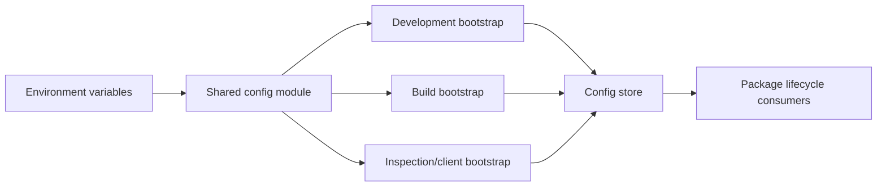

# TOP-008: Configuration As Operational Policy

## Finding

Stackpress configuration is executable TypeScript composition that selects
environment and application policy. Packages inspect only their owned sections
and install mechanisms through lifecycle events. Shared modules and object
spreads form the current layering system.

## Policy Domains

| Domain | Examples of selected policy |
| --- | --- |
| Server | mode, cwd, host, port, build paths |
| Client | package/module identity, output language, revisions, formatting |
| Database | adapter registration, migration paths, cascades, population plan |
| View | Reactus mode, paths, templates, assets, shared props, no-view flag |
| Session/auth | cookie identity, seed, roles, route/event permissions, flows |
| API | endpoints, caller type, scopes, webhooks, CORS |
| MCP | transports, tools, caller type, scopes, schemas |
| Presentation | brand, language, admin menu, theme-oriented props |
| Distribution | loaded plugins, package schemas, bootstrap target |

## Composition Pattern

Later object spreads and explicit properties win according to normal JavaScript
semantics. Environment variants can intentionally change view engines, output
paths, session access, transports, and enabled packages.

## Mechanism Boundary

Config describes choices and mappings; it does not implement the behavior:

- database config selects an adapter and operation inputs; SQL packages execute;
- API and MCP config map exposure to events; adapters authenticate and invoke;
- view config selects Reactus policy; Reactus renders and builds;
- population config names events; those event handlers own domain behavior;
- session access lists declare permissions; session middleware enforces routes.

## Current Validation Model

- exported TypeScript types provide compile-time guidance;
- packages apply defaults and often disable themselves when a section is absent;
- normal module loading catches syntax and import failures;
- individual mechanisms may normalize their own config, as MCP tools do.

No framework-wide runtime schema validation, unknown-key detection, secret
classification, config provenance, or environment-drift comparison was found.

## Operational Guidance

1. Keep reusable defaults in a shared module and environment differences in
   explicit bootstrap modules.
2. Load secrets from the environment; do not preserve template fallback seeds in
   deployed applications.
3. Treat route permissions, API exposure, MCP exposure, and dev asset routes as
   security policy requiring review.
4. Keep generated paths and package names aligned across generation and runtime.
5. Verify each bootstrap independently because TypeScript compatibility does not
   prove complete runtime policy.

## Canonical Explanation

Configuration is the application's operational policy layer. It composes typed
choices for packages and environments, while lifecycle plugins implement and
enforce those choices.

## Evidence Anchors

- `templates/blog/config/common.ts`, `develop.ts`, `build.ts`, and `client.ts`
- package `types.ts` config contracts
- all package plugin config reads
- Ingest config storage and loader behavior

## Resolution

Evidence strength: strong. Adopt "executable operational policy." Carry runtime
validation, provenance, secret handling, and drift detection into TOP-013.

