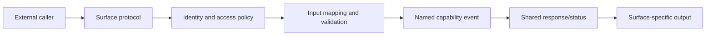

# TOP-009: Access-Surface Adapters

## Finding

Stackpress exposes capabilities through multiple adapters, but each adapter owns
its external protocol, identity model, authorization checks, input mapping, and
response mapping. Named events are the shared internal invocation protocol, not
a universal public API or automatic security boundary.

## Surface Matrix

| Surface | Entry contract | Identity/access | Event mapping | Output |
| --- | --- | --- | --- | --- |
| CLI | parsed command and terminal flags | local process/operator | command name becomes event | terminal status/output |
| Page/admin | route, request, session, CSRF | route permission and page checks | handlers resolve domain events | redirect, HTML, or status |
| Configured API | HTTP method/path/body | public, app token, or session token plus scopes | endpoint config names event | HTTP response/status |
| OAuth | browser routes and token requests | application/session records and secrets | resolves session/application events | redirects and token data |
| MCP | tool schema and transport call | public, app, or user context plus scopes | tool config or generated resolver names event | MCP content/result |
| Desktop | CLI command, menu, private runtime request | local runtime token and route policy | menu/desktop name resolves event | native action or app result |
| Plugin | direct server call | trusted in-process code unless it checks policy | explicit event name | shared response object |

## Adapter Flow

## Generated Versus Configured Exposure

- Admin routes are generated from model metadata and registered from the client.
- Model event listeners are generated but remain internal until a surface maps
  or directly calls them.
- API endpoints are explicit configuration mappings.
- MCP model tools can be generated, while final tool visibility and overrides
  are selected in config.
- CLI operations are registered by packages and selected by command name.
- Desktop capabilities are optional plugin contributions and runtime commands.

Generation therefore supplies candidate integrations, not universal exposure.

## Authorization Findings

- Session middleware can globally enforce route permissions.
- Generated/admin pages also use session capabilities and CSRF where relevant.
- Configured API endpoints apply caller type and scope checks before emitting.
- MCP creates caller-filtered registries and checks authorization again at call
  time, then validates JSON-schema-derived inputs.
- Public API or MCP mappings intentionally bypass identity checks by policy.
- Direct in-process event resolution has no automatic caller authorization.

## Consistency Risks

- equivalent API, page, and MCP operations can receive different access policy;
- errors and validation details can map differently across protocols;
- static endpoint/tool config can drift from generated event contracts;
- nested event calls can lose external caller context unless data is forwarded;
- observability and audit identity are not centralized across surfaces.

## Canonical Explanation

Stackpress lets different interfaces call shared server capabilities. Each
interface remains an adapter with its own protocol and security obligations,
allowing reuse without pretending that people, applications, AI, and local tools
are the same kind of caller.

## Evidence Anchors

- `packages/stackpress-server/src/Terminal.ts`
- `packages/stackpress-session/src/session/`
- `packages/stackpress-admin/src/transform/`
- `packages/stackpress-api/src/plugin.ts` and `src/helpers.ts`
- `packages/stackpress-ai/src/plugin.ts`, helpers, transports, and generated tools
- `packages/stackpress-desktop/src/plugin.ts` and runtime

## Resolution

Evidence strength: strong. Adopt surface-specific adaptation and explicit
exposure. Carry shared authorization descriptors, caller propagation, error
mapping, and audit policy into TOP-013 and TOP-014.

