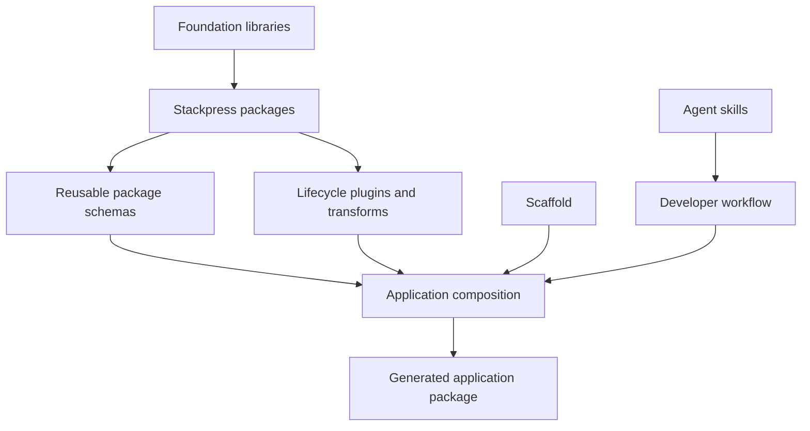

# TOP-010: Package-Style Reuse And Distribution

## Finding

Stackpress treats reusable concerns as packages at several levels: Idea schemas,
Ingest plugins, generated transforms and runtime registries, granular code
exports, React page entries, project scaffolds, and agent skills. Package-style
reuse is therefore an ecosystem principle, not only an npm publishing detail.

## Distribution Units

| Unit | Carries | Discovery/loading |
| --- | --- | --- |
| Idea schema | types, models, metadata, plugin declarations | `use` path/package resolution |
| Ingest plugin | lifecycle listeners, services, events, routes | manifest `plugins` and bootstrap loader |
| Generator transform | emitted contract for one runtime consumer | Idea plugin registry, extended by `idea` |
| Generated client | app-specific registries, actions, stores, views, tools | configured client module import |
| Package export | narrow runtime/type/style entrypoint | Node package exports/typesVersions |
| React page entry | Head/Page/document behavior | host route plus Reactus module resolution |
| Root scaffold | baseline app structure and dependencies | dependency-free `stackpress create` |
| Agent skill | supported developer workflow and assets | dependency-free `stackpress skills` |

## Reuse Stack

## Composition Semantics

- Idea `use` merges imported structures with local precedence; column attributes
  are not deeply merged where finality semantics are absent.
- Package manifests can advertise plugin entrypoints loaded during bootstrap.
- The aggregate Stackpress plugin provides a default package order without
  preventing applications from loading optional packages.
- Granular exports preserve narrow imports and independent package ownership.
- Generated clients combine multiple transform outputs into one app-owned package.
- Reactus entries remain routable modules rather than framework-global pages.

## Root Distribution Boundary

The root CLI is intentionally dependency-free for GitHub/npm cache execution. It
can copy a validated scaffold or install skills without monorepo dependencies.
Normal runtime events are delegated to the TypeScript framework CLI only when the
runtime checkout and `tsx` are available.

This separates adoption/bootstrap distribution from installed application
runtime distribution.

## Compatibility Dimensions

A reusable package can depend on:

- Idea grammar and merge semantics;
- metadata namespaces and schema helper behavior;
- lifecycle names, registration priority, and aggregate order;
- generated file and export contracts;
- foundation library and adapter versions;
- Reactus/Frui/r22n module exports;
- scaffold assumptions and skill instructions.

Semver alone does not currently declare these dimensions, and no central package
discovery or compatibility registry was found.

## Package Author Guidance

1. State which units the package ships: schema, plugin, transform, runtime,
   views, styles, config types, or skills.
2. Keep generation with the runtime consumer that requires it.
3. Publish narrow exports and include non-code schema/style assets explicitly.
4. Document lifecycle phases, events, metadata namespaces, config, and ordering.
5. Test standalone loading, aggregate loading, clean generation, repeat
   generation, and packed-file contents.
6. Separate illustrative scaffold/skill examples from required package names.

## Canonical Explanation

Stackpress makes architecture distributable. Packages can contribute domain
models, lifecycle behavior, generated contracts, interfaces, and even supported
developer workflows while preserving explicit ownership boundaries.

## Evidence Anchors

- sibling Idea `Transformer._merge` and package-style resolution
- sibling Ingest plugin loader and package manifest behavior
- `packages/*/package.json`, `.idea` assets, plugins, and transforms
- `packages/stackpress/src/plugin.ts`
- `bin/stackpress.mjs` and root `package.json`
- `skills/`

## Resolution

Evidence strength: strong. Adopt package-style architectural distribution.
Carry compatibility metadata and discovery into TOP-013; carry contributor
routing and verification into TOP-014.

