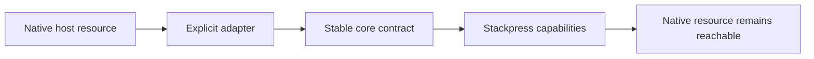

# TOP-012: Portability Through Explicit Adapters

## Finding

The Stackpress ecosystem pursues portability by keeping core contracts narrow and
placing host-specific behavior in explicit adapters. Native request, response,
connection, stream, and build resources remain available instead of being hidden
behind a lowest-common-denominator runtime.

## Adapter Layers

| Boundary | Core contract | Current adapters/evidence |
| --- | --- | --- |
| Server transport | Ingest Server/Router/Request/Response | Node HTTP and WHATWG; Ingest examples for Lambda, Netlify, Vercel |
| Database | Inquire Engine/Dialect/Connection | mysql2, pg, PGlite, sqlite3 |
| Rendering host | Reactus document/render/build | native HTTP plus Express, Fastify, Hapi, Koa, Nest, Restify examples |
| Stackpress entry | aggregate lifecycle and capabilities | `stackpress/http` and `stackpress/whatwg` exports |
| View development | Stackpress view adapter | Node HTTP/Vite middleware in inspected development path |
| AI transport | capability/tool registry | stdio, streamable HTTP, SSE |
| Desktop | local Stackpress HTTP app | Electron shell and electron-builder packaging adapter |

Examples demonstrate intended integration shapes, not equal release guarantees.

## Boundary Pattern

## What Portability Does Mean

- domain capabilities and lifecycle plugins can remain mostly host-independent;
- SQL intent can remain stable while connector/dialect packages change;
- rendering entries can be host-routed rather than owning an HTTP server;
- transport-specific logic is discoverable in narrow modules;
- applications retain access to native resources for advanced behavior.

## What Portability Does Not Mean

- every package works unchanged on every server or edge runtime;
- Node-only dependencies disappear when using WHATWG request shapes;
- SQL dialects produce identical DDL, migration, or transaction behavior;
- Reactus host examples prove Stackpress view integration on those hosts;
- desktop, MCP, SSR, database, and serverless combinations share one test matrix;
- native escape hatches are portable by definition.

## Stackpress-Specific Constraints

- development view handling checks Node `IncomingMessage` and `ServerResponse` to
  attach Reactus/Vite middleware;
- generated code and package loaders depend on module/filesystem capabilities;
- database connectors have separate native or WASM/runtime requirements;
- desktop deliberately starts a local HTTP runtime inside Electron;
- production targets must provide compatible generated client and asset paths.

## Support-Level Vocabulary

Use distinct labels in future KB material:

| Label | Required evidence |
| --- | --- |
| Architectural | core interface and adapter boundary exist |
| Implemented | adapter source is present and builds |
| Tested | current automated tests exercise the combination |
| Demonstrated | maintained example shows an integration path |
| Supported | project promises maintenance and release compatibility |

Do not infer "supported" from an export, example, or architectural possibility.

## Verification Matrix Dimensions

- Node HTTP versus WHATWG/serverless host;
- development, production SSR, static assets, and hydration;
- MySQL, PostgreSQL, PGlite, and SQLite connectors;
- generated client language/module/output mode;
- API, MCP transports, and desktop shell;
- filesystem, stream, process, and dynamic-import availability.

## Evidence Anchors

- sibling Ingest adapters and deployment examples
- sibling Inquire connector packages
- sibling Reactus host examples and server/build source
- `packages/stackpress/src/server/http.ts` and `whatwg.ts`
- Stackpress SQL adapter exports, view configuration, AI transports, and desktop

## Resolution

Evidence strength: strong for the adapter principle. Current source does not
justify one blanket support matrix. Adopt evidence-level vocabulary and carry
the actual tested/supported combinations into release governance.

