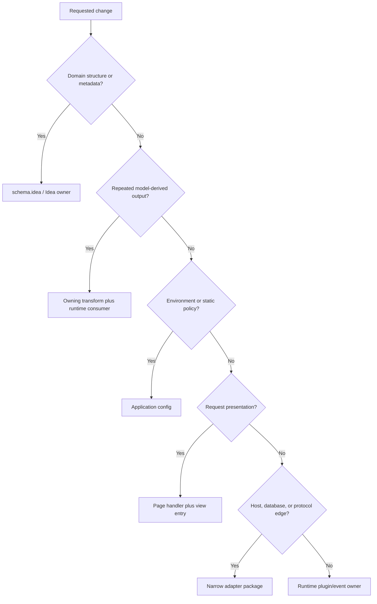

# TOP-014: Contributor Decision System

## Finding

Safe Stackpress contribution begins by locating semantic ownership, generation
ownership, runtime consumption, lifecycle phase, access surface, and required
evidence. Folder proximity alone is not enough because one feature can cross
Idea, transforms, generated output, runtime packages, and application plugins.

## Routing Decision Tree

Mixed features should be split across lanes rather than assigned to one large
plugin for convenience.

## Ownership Matrix

| Change | Primary owner | Required companion check |
| --- | --- | --- |
| grammar, `use`, AST, plugin runner | Idea | Stackpress schema consumption |
| model/column semantic helper | stackpress-schema | every consuming transform |
| SQL builder/dialect/connector | Inquire | generated store and DB workflow |
| generated stores/actions/events | stackpress-sql transform | SQL listen/runtime contract |
| generated fields/formats | stackpress-view transform | Frui/r22n/admin consumption |
| generated admin workflow | stackpress-admin transform | route phase and session policy |
| server/router/adapter primitive | Ingest | Stackpress entry exports/templates |
| SSR/hydration/build | Reactus | stackpress-view adapter and pages |
| generic UI behavior | Frui | generated imports and rendered use |
| translation runtime | r22n | generated phrase stability |
| API/MCP/desktop surface | owning package | event contract and caller policy |
| app-specific orchestration | local plugin | lifecycle/event reachability |
| static environment choice | config | each selected package mechanism |
| scaffold/skill workflow | root distribution/skill | acceptance against current app |

## Lifecycle Routing

- plugin initialization: dependency-free state and phase listener declaration;
- `config`: services and environment-derived mechanism configuration;
- `listen`: reusable operational events and generated listeners;
- `route`: request-facing routes after capabilities exist;
- `idea`: package-owned generation transforms;
- custom contribution events: extensible package registries before initialization.

## Verification Matrix

| Change class | Minimum convincing evidence |
| --- | --- |
| Idea/schema | parse/compile plus expected normalized schema |
| Transform | clean generation, repeat generation, removal/rename behavior |
| Generated/runtime pair | generated compile/import plus lifecycle registration |
| Data | dialect query assertions and transactional workflow proof |
| Page/view | route binding, SSR, hydration, interaction, browser snapshot review |
| Access surface | auth, validation, event call, status/error mapping |
| Adapter | native-resource integration and target-specific test |
| Package manifest | build plus pack/export/import verification |
| Scaffold/skill | clean install/copy acceptance and current command workflow |
| Cross-package | narrow package tests plus affected template/end-to-end path |

Fresh evidence is required after the relevant change; source presence alone does
not prove runtime reachability.

## Change Procedure

1. State the intended behavior and affected callers.
2. Identify semantic owner and whether output is generated.
3. Map producer, generated artifact, runtime consumer, and surfaces.
4. Select the lifecycle phase and narrow package owner.
5. Check compatibility dimensions and current versions.
6. Implement without editing disposable generated output as the durable source.
7. Run the smallest convincing proof for each affected contract.
8. Run broader integration only where shared behavior or blast radius requires.
9. Update docs, skills, exports, or examples when their contract changed.

## Review Gates Still Needed

The source establishes ownership patterns but does not define a maintainer map,
CODEOWNERS policy, required release matrix, or review authority for public event,
metadata, generated, and adapter contracts. Those remain governance decisions.

## Evidence Anchors

- package plugin/transform/runtime ownership maps from all research ledgers
- root and package scripts/tests/manifests
- `skills/stackpress-plugin-router/`
- `skills/stackpress-app-coordinator/`
- `skills/stackpress-app-verification/`
- templates and generated client tests

## Resolution

Evidence strength: strong. Adopt ownership-first routing and contract-scaled
verification. Carry maintainer ownership, public-contract review, and release
gates into Phase 6 governance/context boundaries rather than inventing them.

