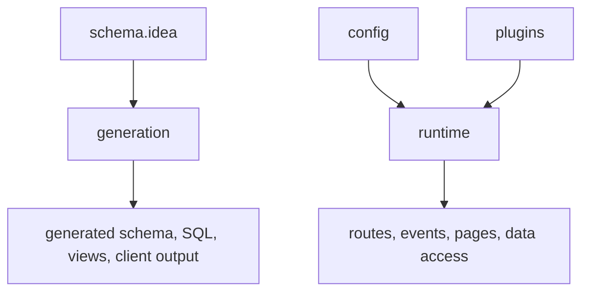

# 001 What Stackpress Is

Understand Stackpress as a schema-first app framework that combines runtime, generation, data, and views into one workflow. This first map matters because the later lessons move between files, commands, and generated output quickly.

**Course context:** This is the first orientation lesson in the content path. It gives you the map for the later courses, so the first build steps have a framework to attach to.

## 001.1. What Stackpress Is

Stackpress is easier to learn when you treat it as three cooperating pieces: source files you edit, generated files you inspect, and runtime behavior your users touch. This lesson gives you that map before you start building, so later commands and folders feel connected instead of random.

## 001.2. The Pieces

Think about Stackpress in this order:

 1. Write source input.
 2. Run generation.
 3. Push database structure.
 4. Run and inspect the app.

The main source inputs are:

 - `schema.idea`
 - `config/*`
 - `plugins/*`
 - `public/*`

## 001.3. How A Request Moves

Stackpress is not only a server and not only a code generator. It is an app-facing composition layer that brings several lower-level capabilities into one workflow.

The diagram shows the loop that will repeat throughout the course. You edit source inputs, Stackpress turns some of that input into generated output, and the runtime uses both authored and generated pieces when the app receives requests.

## 001.4. What Gets Generated

This section separates the main pieces so the rest of the course has names to reuse. Source input, generated output, runtime behavior, and plugin boundaries are different jobs, but they work together in the same Stackpress project.

### 001.4.1. Source Input

Source input is what you intentionally edit. It describes the app's model, configuration, routes, views, assets, and custom behavior.

### 001.4.2. Generated Output

Generated output is created from source input. It can include schema classes, SQL-facing helpers, admin output, and client-facing TypeScript.

### 001.4.3. Runtime Behavior

Runtime behavior is what happens when the app boots, receives a request, runs an event, renders a view, or talks to a database. This is the part users experience directly, even when generated files helped prepare the code behind it.

### 001.4.4. Plugin Boundary

Plugins keep framework behavior and app-specific behavior separated. Stackpress provides the framework layer; your app adds local plugins around it.

### 001.4.5. When You Change Data Shape

Edit `schema.idea`, then run generation and database commands. That path is for structural changes, such as adding a model field or changing how data should be stored.

### 001.4.6. When You Change App Behavior

Edit local plugins, page handlers, event handlers, or views. That path is for behavior changes, such as adding a route, rendering a page, or responding to an event.

### 001.4.7. When You Need Exact Details

Use reference pages for exact imports, config fields, command flags, attributes, and type details. The course pages teach the path first; reference pages help when you already know what you are looking for.

## 001.5. Where To Go Next

The takeaway is the map, not a list of APIs to memorize. When later lessons mention source input, generated output, runtime behavior, or plugins, you should be able to place that topic in the larger workflow.

Start the `100 Develop` course when you are ready to build the first route. Use [Overview](/concepts/overview), [Schema And Generation](/concepts/schema-and-generation), and [Plugin System](/concepts/plugin-system) for deeper concepts.

**Learning checkpoint:** Before moving on, make sure you can explain the main problem this lesson solved and point to where the idea appears in a Stackpress project. You do not need the full reference yet; the goal is to recognize the pattern and know what to inspect next.

**Next course:** Continue with `110 Scaffold`. That course picks up from here and moves the learning path forward without turning this page into a full reference.
