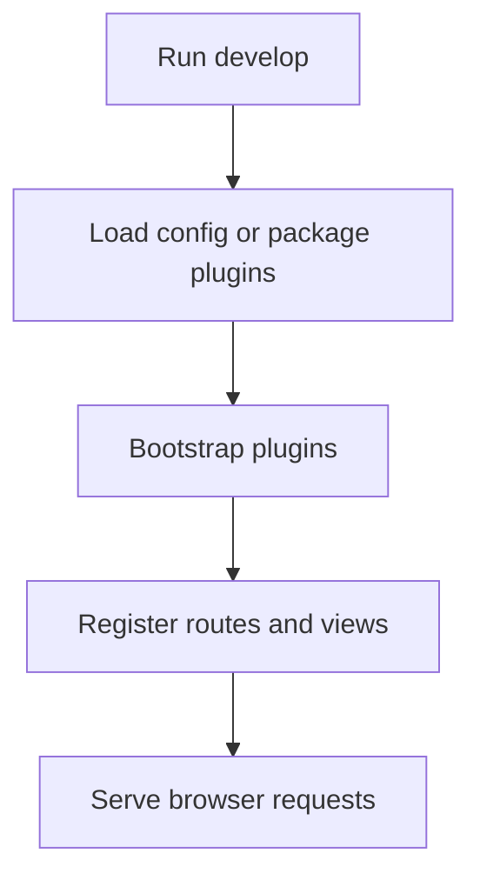

# 113 Dev Server

Start a Stackpress app locally, understand what the development server loads, and verify a route or view in the browser. Compare the concrete details to see the practical meaning.

**Previously:** The previous lesson, `110 Scaffold`, gave you the setup this page builds on. Here, the focus shifts to `Dev Server` so you can place the next Stackpress surface in the course path.

## 113.1. When To Run The Dev Server

After the first route works, the next skill is learning how to keep the app running while you change it. The development server is your workshop bench: it loads config, plugins, routes, and views so you can see mistakes quickly.

## 113.2. Start The Server

From the app folder, run:

```bash
npx stackpress develop -v
```

Open:

```text
http://localhost:3000/
```

If your app has the route from `110 Scaffold`, the response should be:

```text
Hello Stackpress
```

For an app that already has a config file, run the command with the bootstrap module:

```bash
stackpress develop --b config -v
```

This example keeps the first version narrow on purpose. Once this shape is clear, the surrounding section can add options without making the first step harder to follow.

## 113.3. Read The Logs

`develop` starts the local development server. Stackpress loads your app, applies the plugin list, registers listeners and routes, and serves requests from the configured local host and port.

The `-v` flag enables verbose output. Keep it on while learning because it helps you see which config or plugin file failed to load.



Read the example by finding the helper first, then the value or file it acts on. That habit makes the code easier to scan when the same pattern appears in a larger app.

## 113.4. Stop And Restart

This part of the Dev Server workflow is easier to follow when the smaller pieces are compared together. The subsections cover Bootstrap Module, Local Server, View Engine, so the reader can see how each piece changes the local decision.

### 113.4.1. Bootstrap Module

A bootstrap module is the file Stackpress loads before a command runs. Small apps can start from `package.json` plugins only. Larger apps usually pass `--b config` so Stackpress can load server, view, database, and plugin settings from config.

### 113.4.2. Local Server

The local server receives browser requests and sends them through the route handlers registered by your plugins. The examples stay practical by tying the idea to something you can run, change, or verify.

### 113.4.3. View Engine

When your app adds React views, the development server also connects the view engine. That is why view-focused apps usually need config for Vite, CSS, document templates, and client route settings.

## 113.5. Common Startup Problems

This part of the Dev Server workflow is easier to follow when the smaller pieces are compared together. The subsections cover Add A Script, Check A Route From The Terminal, Fix Startup Failures, so the reader can see how each piece changes the local decision.

### 113.5.1. Add A Script

Once the command works, add a script to `package.json`:

```json
{
  "scripts": {
    "develop": "stackpress develop --b config -v"
  }
}
```

Then run:

```bash
npm run develop
```

This example ties the concept to an actual Stackpress shape. Notice how the file or helper creates behavior the app can later run, inspect, or generate from.

### 113.5.2. Check A Route From The Terminal

Use `curl` when you want to verify a route without a browser:

```bash
curl http://localhost:3000/
```

Use this as the concrete version of the explanation above. The part to copy is the structure; the part to change is the value that matches your app.

### 113.5.3. Fix Startup Failures

If the server does not start, check:

 - the command is running from the app folder
 - the bootstrap path after `--b` exists
 - every plugin in `package.json` exists
 - the route file has a default export when imported through `server.import`

## 113.6. Next Step

The important checkpoint is knowing where Dev Server belongs in the Stackpress workflow. That is why this detail appears in the lesson before reference material.

Next, use `120 Plugins` and its leaf pages to understand how app behavior is organized. For command details, use [CLI command details](/reference/cli-reference).

**Learning checkpoint:** Before moving on, make sure you can explain the main problem this lesson solved and point to where the idea appears in a Stackpress project. You do not need the full reference yet; the goal is to recognize the pattern and know what to inspect next.

**Next course:** Continue with `121 Composition`. That course picks up from here and moves the learning path forward without turning this page into a full reference.
