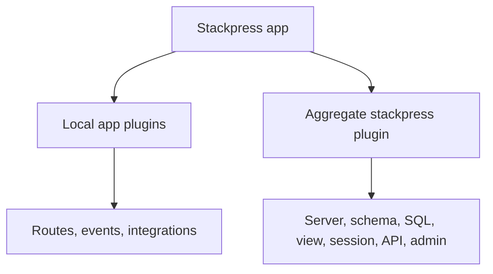

# 121 Composition

Understand how Stackpress framework plugins and local app plugins work together without mixing every responsibility into one file. Look for the concept in the Stackpress files, helpers, or runtime behavior in this section.

**Previously:** The previous lesson, `113 Dev Server`, gave you the setup this page builds on. Here, the focus shifts to `Composition` so you can place the next Stackpress surface in the course path.

## 121.1. What Composition Means

A growing app quickly stops being one kind of code. Routes, events, stores, generated output, and integrations all need a place to live, and composition is how Stackpress keeps those parts from becoming one tangled file.

## 121.2. Packages And Plugins

A typical app has a plugin list like this:

```json
{
  "plugins": [
    "./plugins/app/plugin",
    "./plugins/store/plugin",
    "stackpress"
  ]
}
```

Read it as:

 - `./plugins/app/plugin` owns app-facing routes, pages, and app events.
 - `./plugins/store/plugin` owns local store or data wiring.
 - `stackpress` loads the standard framework behavior.

## 121.3. How Configuration Wires Them

The aggregate `stackpress` plugin loads coordinated framework capabilities such as server, schema, language, CSRF, SQL, view, session, API, and admin behavior. The same idea shows up through inspectable project surfaces.

Your local plugins sit beside that framework layer. They should attach app-specific behavior without replacing the framework stack.



This example keeps the first version narrow on purpose. Once this shape is clear, the surrounding section can add options without making the first step harder to follow.

## 121.4. Small Example

This part of the Composition workflow is easier to follow when the smaller pieces are compared together. The subsections cover Framework Plugin, Local Plugin, Composition, Decide Where Behavior Belongs, so the reader can see how each piece changes the local decision.

### 121.4.1. Framework Plugin

A framework plugin provides reusable Stackpress behavior. Most apps use the aggregate `stackpress` entry instead of listing every framework package plugin.

### 121.4.2. Local Plugin

A local plugin is app-owned code. It should be the first place you put behavior that is specific to your product or workflow.

### 121.4.3. Composition

Composition means each plugin registers its part of the app. You should be able to remove or inspect one local plugin without reading the entire app.

### 121.4.4. Decide Where Behavior Belongs

Use this split:

 - route, page, event, or integration behavior: local plugin
 - framework-wide behavior or generated defaults: config or Stackpress plugin
 - schema meaning and generated admin metadata: `schema.idea`

### 121.4.5. Check Plugin Order

Keep local plugins visible in `package.json`. If a local plugin depends on generated framework behavior, verify the app still boots after changing the order.

### 121.4.6. Avoid One Giant Plugin

When one plugin starts mixing routes, stores, email integrations, and generator wiring, split it by responsibility. The nearby check shows the project-level consequence.

## 121.5. Next Step

The useful shift is recognizing Composition as a pattern in files, commands, and runtime behavior. The example gives the idea a concrete file, command, or code shape.

Read `122 Local Plugins` when you are ready to split app behavior into focused plugin files. For the aggregate plugin reference, use [Plugin export details](/reference/plugin). That page continues the course path with the next Stackpress surface.

**Learning checkpoint:** Before moving on, make sure you can explain the main problem this lesson solved and point to where the idea appears in a Stackpress project. You do not need the full reference yet; the goal is to recognize the pattern and know what to inspect next.

**Next course:** Continue with `122 Local Plugins`. That course picks up from here and moves the learning path forward without turning this page into a full reference.
