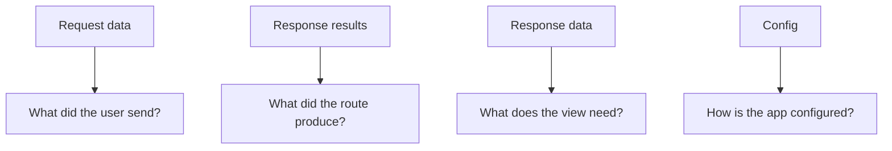

# 133 Data Surfaces

Put values in the correct Stackpress data surface so routes, events, views, and config do not fight over meaning. The main lesson is simple: a value becomes easier to debug when it lives in the place that matches its job.

**Previously:** The previous lesson, `132 Response`, gave you the setup this page builds on. Here, the focus shifts to `Data Surfaces` so you can place the next Stackpress surface in the course path.

## 133.1. What Data Surfaces Are

Values become confusing when they are placed in the wrong home. Stackpress gives request input, response output, view props, and app config separate surfaces so future code can understand what each value means.

## 133.2. Request Data

Use this rule:

 - user input belongs in request data
 - main route output belongs in response results
 - view-only page props belong in response data
 - shared app settings belong in config

```ts
req.data.set('sort', 'published');
res.results({ articles });
res.data.set('page', { title: 'Home' });
```

Each helper stores a value in a different surface. `req.data` carries request input, `res.results` carries the route's main output, and `res.data` carries view-facing metadata.

## 133.3. Config Data

Each surface answers a different question:



The diagram turns the surfaces into questions. If you can answer which question a value belongs to, you can usually choose the correct Stackpress surface.

## 133.4. Generated Data

This section compares the four surfaces that appear most often in route and view work. They are similar enough to confuse at first, so the important skill is matching each value to the question it answers.

### 133.4.1. Request Data

Use request data for inputs that came from the current request or were normalized for downstream handlers. If the value changes from one browser request to the next, it usually does not belong in config.

### 133.4.2. Response Results

Use response results for the primary successful output. Views can render results, and APIs can return them.

### 133.4.3. Response Data

Use response data for view-facing props such as page metadata, brand values, locale values, and navigation data. These values help the page render, but they are not usually the main business result of the route.

### 133.4.4. App Config

Use config for values that exist before a request starts, such as brand settings, route bases, database settings, language settings, and feature options. Config is the app's setup information, not the visitor's submitted input.

## 133.5. How To Choose

This section walks through common choices where the surfaces can blur together. Default sort belongs to request data, records belong to results, and page metadata belongs to response data.

### 133.5.1. Set A Default Sort

```ts
if (!req.data.has('sort')) {
  req.data.set('sort', 'created', 'desc');
}
```

This example normalizes missing input before later code reads it. The default still belongs to request data because it is shaping the current request's filtering behavior.

### 133.5.2. Return Records

```ts
res.results({
  rows,
  total
});
```

This response contains the route's primary result. A view or API client should be able to read `rows` and `total` without digging through view metadata or config.

### 133.5.3. Set Page Metadata

```ts
res.data.set('page', {
  title: 'Articles',
  description: 'Latest articles'
});
```

This metadata helps the page describe itself. It belongs in `res.data` because the title and description support rendering rather than representing the route's main data result.

## 133.6. Next Step

What changed in this lesson is your map: request data, response results, response data, and config no longer mean the same thing. When a route feels confusing, ask what job the value is doing before deciding where to store it.

Read `152 Server Props` when you are ready to consume these surfaces from React views. That page continues the course path with the next Stackpress surface.

**Learning checkpoint:** Before moving on, make sure you can explain the main problem this lesson solved and point to where the idea appears in a Stackpress project. You do not need the full reference yet; the goal is to recognize the pattern and know what to inspect next.

**Next course:** Continue with `134 Session`. That course picks up from here and moves the learning path forward without turning this page into a full reference.
