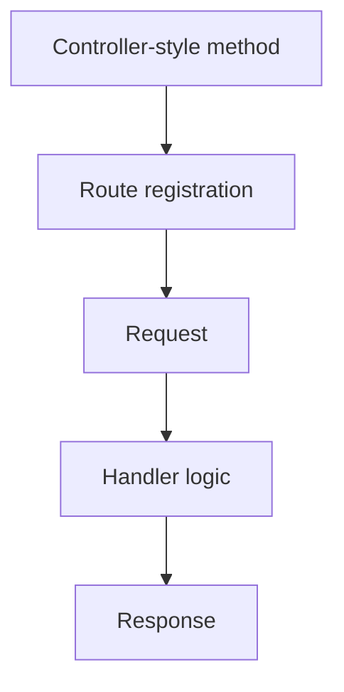

# 135 Nest

Recognize when Nest-style controller composition is useful and how it maps back to normal Stackpress route handling. The nearby check shows the project-level consequence.

**Previously:** The previous lesson, `134 Session`, gave you the setup this page builds on. Here, the focus shifts to `Nest` so you can place the next Stackpress surface in the course path.

## 135.1. The Decision

Controller-style code can look like a new way to build an app, but it is mostly a way to organize route handlers. The useful question is not whether Nest-style code is special; it is whether it makes the underlying route flow easier to read.

## 135.2. Recommended Default

Start from the route shape you already know:

```ts
server.get('/articles/:slug', async ({ req, res }) => {
  const slug = req.data('slug');
  res.results({ slug });
});
```

A controller-style wrapper still needs to resolve to the same basic idea:

 - match a route
 - read request input
 - run app logic
 - write response output

## 135.3. When To Nest Plugins

Stackpress route handling is the base model. Nest-style organization can group route handlers into classes or modules, but the app still has to register routes and produce response outcomes.



This example keeps the first version narrow on purpose. Once this shape is clear, the surrounding section can add options without making the first step harder to follow.

## 135.4. Tradeoffs

This part of the Nest workflow is easier to follow when the smaller pieces are compared together. The subsections cover Normal Routes First, Controllers Are Organization, Map Back To Handlers, so the reader can see how each piece changes the local decision.

### 135.4.1. Normal Routes First

Learn normal routes before adding controller abstractions. It makes debugging easier because you know what the abstraction must produce.

### 135.4.2. Controllers Are Organization

Controller-style code can group related actions, but it should not hide request and response behavior from the developer reading the route. The example gives the idea a concrete file, command, or code shape.

### 135.4.3. Map Back To Handlers

When a controller is confusing, ask which normal handler it maps to and what request and response objects it uses. The examples below turn the concept into concrete Stackpress project surfaces.

## 135.5. Example Layout

This part of the Nest workflow is easier to follow when the smaller pieces are compared together. The subsections cover Decide Whether To Use It, Debug A Controller, Avoid Premature Structure, so the reader can see how each piece changes the local decision.

### 135.5.1. Decide Whether To Use It

Use controller-style composition when several related routes share dependencies or naming. Keep direct route handlers when the app is small.

### 135.5.2. Debug A Controller

Find the route it registers, then inspect the handler outcome the same way you would inspect any Stackpress route. Use that purpose as the anchor for the local example or check.

### 135.5.3. Avoid Premature Structure

Do not introduce controller layers just to make a first route. Add structure after route behavior is real enough to benefit from grouping.

## 135.6. Next Step

For Nest, focus first on the problem it solves, then use the syntax as the concrete way Stackpress represents that problem. The same idea shows up through inspectable project surfaces.

Read `140 Events` and `141 Terminal Events` to understand another kind of composition: shared event behavior. Read it as the continuation of the course sequence, not as a standalone lookup page.

**Learning checkpoint:** Before moving on, make sure you can explain the main problem this lesson solved and point to where the idea appears in a Stackpress project. You do not need the full reference yet; the goal is to recognize the pattern and know what to inspect next.

**Next course:** Continue with `141 Terminal Events`. That course picks up from here and moves the learning path forward without turning this page into a full reference.
