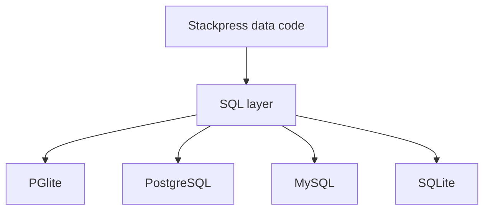

# 211 Dialects

Choose the right SQL dialect for local development or deployment, and know when the choice matters. Keep the idea tied to the concrete project surface in this section.

**Previously:** The previous lesson, `160 Debugging And Inspection`, gave you the setup this page builds on. Here, the focus shifts to `Dialects` so you can place the next Stackpress surface in the course path.

## 211.1. The Decision

SQL is not one language in practice; each database family has its own dialect. Stackpress can help build statements, but you still need to know which database shape you are choosing for local and production work.

## 211.2. Recommended Default

Use this default path for learning:

 - local development: PGlite
 - production PostgreSQL app: PostgreSQL
 - production MySQL app: MySQL
 - SQLite-specific app: SQLite

For most course work, start with PGlite because it is lightweight and file-backed. That is why this detail appears in the lesson before reference material.

## 211.3. Dialect Options

SQL databases share many ideas, but they do not all use identical syntax, connection drivers, or type behavior. Stackpress exposes dialect-specific public paths so an app can connect through the database it actually uses.

This example keeps the first version narrow on purpose. Once this shape is clear, the surrounding section can add options without making the first step harder to follow.

## 211.4. Tradeoffs

This part of the Dialects workflow is easier to follow when the smaller pieces are compared together. The subsections cover Dialect, Connection, Builder, so the reader can see how each piece changes the local decision.

### 211.4.1. Dialect

A dialect is the SQL language variant and helper behavior for a database family. Look for the concept in the Stackpress files, helpers, or runtime behavior in this section.

### 211.4.2. Connection

A connection is the runtime object that talks to the database. Templates usually register it during the `config` lifecycle.

### 211.4.3. Builder

Builders create SQL statements in a dialect-aware way. Most app developers first meet query behavior through generated events and stores.

## 211.5. Example Choice

This part of the Dialects workflow is easier to follow when the smaller pieces are compared together. The subsections cover Choose A Local Database, Choose A Production Database, Know When To Care, so the reader can see how each piece changes the local decision.

### 211.5.1. Choose A Local Database

Use PGlite when you want local development without managing an external database server. The same idea shows up through inspectable project surfaces.

### 211.5.2. Choose A Production Database

Use PostgreSQL or MySQL when the deployment environment provides that database. The nearby check shows the project-level consequence.

### 211.5.3. Know When To Care

You need to care about dialects when configuring a connection, writing raw SQL, debugging generated SQL, or deploying to a different database family. The example gives the idea a concrete file, command, or code shape.

## 211.6. Next Step

Use Dialects as a guide for choosing which file, command, or generated output to inspect next. The examples stay practical by tying the idea to something you can run, change, or verify.

Read `212 SQLite / PGlite` for the local development path. For exact exports, use [SQL Reference](/reference/sql), [PGlite Reference](/reference/pglite), [PostgreSQL Reference](/reference/pgsql), and [MySQL Reference](/reference/mysql). That page continues the course path with the next Stackpress surface.

**Learning checkpoint:** Before moving on, make sure you can explain the main problem this lesson solved and point to where the idea appears in a Stackpress project. You do not need the full reference yet; the goal is to recognize the pattern and know what to inspect next.

**Next course:** Continue with `212 SQLite / PGlite`. That course picks up from here and moves the learning path forward without turning this page into a full reference.
