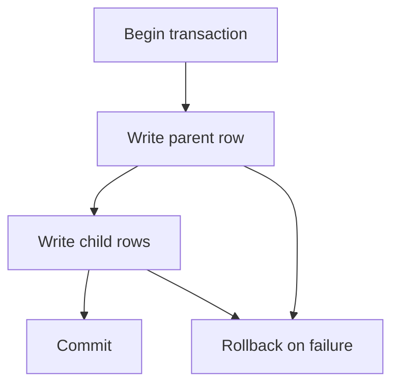

# 232 Transactions

Group dependent data changes so they succeed or fail together. The nearby check shows the project-level consequence.

**Previously:** The previous lesson, `231 Raw SQL`, gave you the setup this page builds on. Here, the focus shifts to `Transactions` so you can place the next Stackpress surface in the course path.

## 232.1. Operation Goal

Some writes only make sense as a group. A transaction is the promise that either the whole group succeeds or the database rolls it back so the app is not left halfway changed.

## 232.2. When A Transaction Is Needed

Use a transaction when the flow has more than one dependent write:

```text
create order
create order items
clear cart
```

If any step fails, the earlier steps should be rolled back. The example gives the idea a concrete file, command, or code shape.

## 232.3. Wrap The Operations

A transaction protects a group of database changes. Without one, a failure can leave partial data that the app does not know how to interpret.



This example keeps the first version narrow on purpose. Once this shape is clear, the surrounding section can add options without making the first step harder to follow.

## 232.4. Handle Failure

This part of the Transactions workflow is easier to follow when the smaller pieces are compared together. The subsections cover Dependent Writes, Commit, Rollback, so the reader can see how each piece changes the local decision.

### 232.4.1. Dependent Writes

Writes are dependent when one record only makes sense if the other record also exists. Look for the concept in the Stackpress files, helpers, or runtime behavior in this section.

### 232.4.2. Commit

Commit means the grouped changes become permanent. That context prepares the reader for the more specific form that follows.

### 232.4.3. Rollback

Rollback means the grouped changes are undone because one step failed. Keep the idea tied to the concrete project surface in this section.

## 232.5. Verify Data

This part of the Transactions workflow is easier to follow when the smaller pieces are compared together. The subsections cover Identify Transaction Boundaries, Keep The Group Small, Verify Failure Behavior, so the reader can see how each piece changes the local decision.

### 232.5.1. Identify Transaction Boundaries

Start the transaction before the first dependent write and commit after the last required write. The nearby example or check shows the project detail affected by this idea.

### 232.5.2. Keep The Group Small

Do not wrap unrelated work in the same transaction. Keep the protected set focused.

### 232.5.3. Verify Failure Behavior

Test what happens when the second or third write fails. The database should not keep partial rows.

## 232.6. Common Mistakes

Transactions mistakes usually happen when the route forgets the product rule behind the database operation. Keep the query narrow, keep user input controlled, and make the response show what happened.

### 232.6.1. Wrapping Unrelated Work Together

```ts
await db.transaction(async trx => {
  await saveProfile(trx);
  await sendMarketingEmail();
});
```

A transaction should group database work that must succeed or fail together. Keep unrelated side effects outside the transaction unless they truly belong to the same all-or-nothing unit.

### 232.6.2. Ignoring Failure Behavior

```ts
await db.transaction(async trx => {
  await saveOrder(trx);
  await savePayment(trx);
});
```

The code shows the happy path, but the lesson is the failure path. Test what happens when the second write fails so you know the first write rolls back correctly.

**Learning checkpoint:** Before moving on, make sure you can explain the main problem this lesson solved and point to where the idea appears in a Stackpress project. You do not need the full reference yet; the goal is to recognize the pattern and know what to inspect next.

**Next course:** Continue with `233 JSON Fields`. That course picks up from here and moves the learning path forward without turning this page into a full reference.
