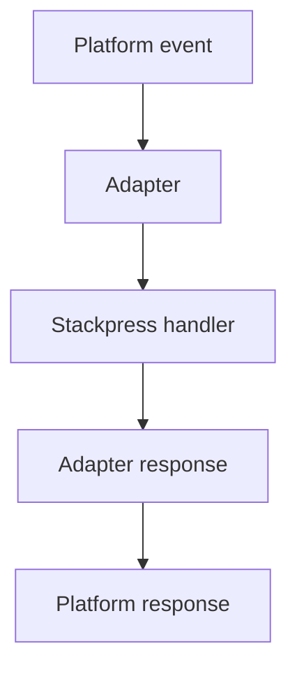

# 350 Lambda / Serverless

Package a Stackpress handler for a serverless target by respecting request/response adaptation and runtime constraints. That is why this detail appears in the lesson before reference material.

**Previously:** The previous lesson, `340 Netlify`, gave you the setup this page builds on. Here, the focus shifts to `Lambda / Serverless` so you can place the next Stackpress surface in the course path.

## 350.1. Current Status

Serverless functions change the shape of runtime thinking. Instead of one long-lived process, the platform calls a handler, so startup, filesystem writes, and connection reuse need extra attention.

## 350.2. Intended Serverless Workflow

Before packaging a function, answer:

 - Which function input shape does the platform send?
 - Which response shape must the function return?
 - Where are assets served from?
 - How is the database connection created and reused?
 - Which files can the function read or write at runtime?

Then build locally:

```bash
stackpress build --b config/build -v
```

This example gives the idea something concrete to inspect. Look for the file, helper, or value that changed; that is the part you would adjust first in your own app.

## 350.3. What Exists Today

Serverless packaging is an adapter problem. The platform sends one request shape, and the Stackpress app expects a compatible server/request flow.



In this example, the useful part is the value being passed, returned, or configured. That is usually the first thing a developer changes when adapting the pattern.

## 350.4. What To Verify

This part of the Lambda / Serverless workflow is easier to follow when the smaller pieces are compared together. The subsections cover Cold Start, Request Adapter, Response Adapter, so the reader can see how each piece changes the local decision.

### 350.4.1. Cold Start

Serverless functions may start from scratch after being idle. Keep bootstrap work clear and avoid assuming one process lives forever.

### 350.4.2. Request Adapter

The adapter converts platform input into the request shape the app can handle. Look for the concept in the Stackpress files, helpers, or runtime behavior in this section.

### 350.4.3. Response Adapter

The response adapter converts Stackpress output into the platform's expected return value. The same idea shows up through inspectable project surfaces.

## 350.5. Open Questions

This part of the Lambda / Serverless workflow is easier to follow when the smaller pieces are compared together. The subsections cover Check File Writes, Check Database Connections, Test One Dynamic Route, so the reader can see how each piece changes the local decision.

### 350.5.1. Check File Writes

Do not assume generated output or database files can be written at runtime in every serverless environment. The nearby check shows the project-level consequence.

### 350.5.2. Check Database Connections

Create database connections in a way that works with the platform's lifecycle. The example gives the idea a concrete file, command, or code shape.

### 350.5.3. Test One Dynamic Route

A successful deploy should prove at least one page route, one action route, and one static asset. The examples below turn the concept into concrete Stackpress project surfaces.

## 350.6. Next Step

The important part is the reason behind Lambda / Serverless: it gives the app a clearer way to organize one kind of behavior. Use that purpose as the anchor for the local example or check.

Move to `400 Project Structure` after you can build and reason about deployment output. The same idea shows up through inspectable project surfaces.

**Learning checkpoint:** Before moving on, make sure you can explain the main problem this lesson solved and point to where the idea appears in a Stackpress project. You do not need the full reference yet; the goal is to recognize the pattern and know what to inspect next.

**Next course:** Continue with `411 Source Of Truth`. That course picks up from here and moves the learning path forward without turning this page into a full reference.
