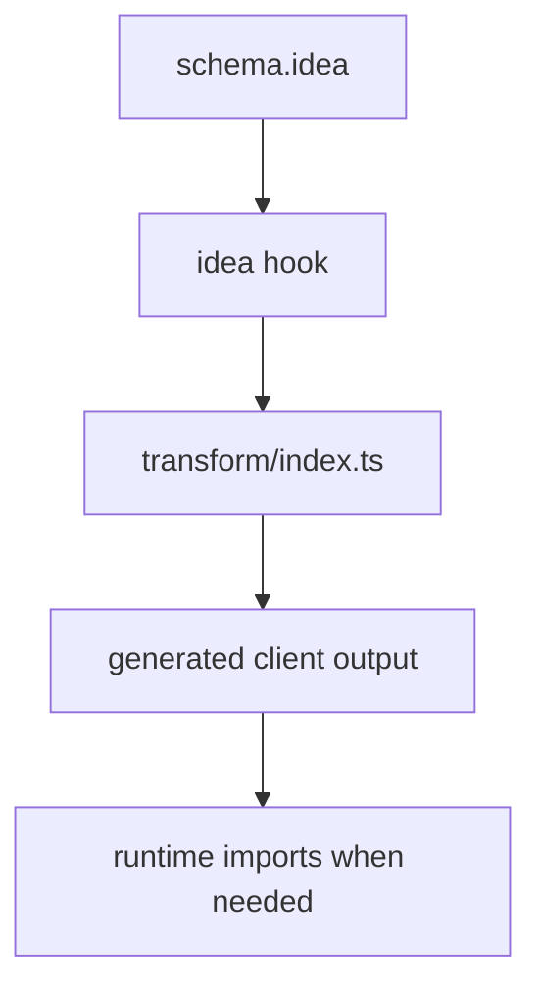

# 542 Custom Generators

Build a small generator that reads schema input and writes one output file through the normal idea transform pipeline. The example gives the decision enough context to evaluate it.

**Previously:** The previous lesson, `541 ts-morph Plugins`, gave you the setup this page builds on. Here, the focus shifts to `Custom Generators` so you can place the next Stackpress surface in the course path.

## 542.1. When To Write A Generator

A custom generator is worth writing when runtime code would repeat the same model-driven structure over and over. The generator moves that repetition into a predictable source-to-output pipeline.

## 542.2. Generator Workflow

A generator plugin usually has:

```text
plugin.ts
transform/index.ts
```

The plugin attaches the transform during the `idea` lifecycle. The transform reads schema input, writes files to the configured generated directory, and exports generated artifacts intentionally.

## 542.3. Register It

You separated generator registration from generator output. Runtime code should consume generated output later through the normal generated client path.



This is the smallest useful version of the idea. Once you can name the moving parts here, the larger version is easier to inspect and debug.

## 542.4. Inspect Output

This part of the Custom Generators workflow is easier to follow when the smaller pieces are compared together. The subsections cover Idea Hook, Transform Entry, Runtime Reconnection, so the reader can see how each piece changes the local decision.

### 542.4.1. Idea Hook

The idea hook connects the plugin to the generation pipeline. Use the check to make the idea visible before moving to the next topic.

### 542.4.2. Transform Entry

`transform/index.ts` is the generator entrypoint that writes output. The examples below turn the concept into concrete Stackpress project surfaces.

### 542.4.3. Runtime Reconnection

If runtime needs generated files, import them through the generated client package instead of regenerating them live. That context prepares the reader for the more specific form that follows.

## 542.5. Common Failures

This part of the Custom Generators workflow is easier to follow when the smaller pieces are compared together. The subsections cover Decide If Generation Fits, Generate One File First, Verify Output, so the reader can see how each piece changes the local decision.

### 542.5.1. Decide If Generation Fits

Use generation when the output is repeated, model-driven, and stable enough to emit during `stackpress generate`. Keep the idea tied to the concrete project surface in this section.

### 542.5.2. Generate One File First

Start with one output file and one clear export. Add registries or per-model folders later.

### 542.5.3. Verify Output

Run:

```bash
stackpress generate --b config -v
```

Then inspect emitted files and package exports. The nearby example or check shows the project detail affected by this idea.

## 542.6. Next Step

You do not need the full reference yet. For Custom Generators, focus on recognizing the pattern and knowing where to look next.

Move to `600 Built-ins` after you understand schema and generation boundaries. Compare the concrete details to see the app-level effect.

**Learning checkpoint:** Before moving on, make sure you can explain the main problem this lesson solved and point to where the idea appears in a Stackpress project. You do not need the full reference yet; the goal is to recognize the pattern and know what to inspect next.

**Next course:** Continue with `611 Sign In`. That course picks up from here and moves the learning path forward without turning this page into a full reference.
