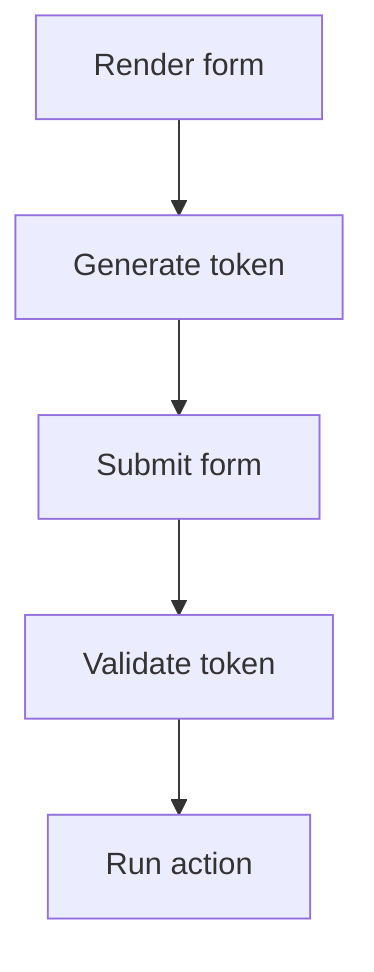

# 640 CSRF

Add protected form actions by generating, validating, and clearing CSRF tokens. The example gives the decision enough context to evaluate it.

**Previously:** The previous lesson, `633 Flash Messages`, gave you the setup this page builds on. Here, the focus shifts to `CSRF` so you can place the next Stackpress surface in the course path.

## 640.1. Flow Goal

State-changing forms need proof that the browser submitted a form your app actually served. CSRF protection adds that proof with a token that travels from page render to action handler.

## 640.2. Config Surface

Check CSRF config:

```ts
export const csrf = {
  name: 'csrf'
};
```

The CSRF plugin uses that name to store and validate a token in request/session flow. Use the check to make the idea visible before moving to the next topic.

## 640.3. Protected Request Flow

The app chose a token name. Protected pages generate a token, forms submit it, and action handlers validate it before writing.



This example gives the idea something concrete to inspect. Look for the file, helper, or value that changed; that is the part you would adjust first in your own app.

## 640.4. Failure Behavior

This part of the CSRF workflow is easier to follow when the smaller pieces are compared together. The subsections cover CSRF, Token, Validation, so the reader can see how each piece changes the local decision.

### 640.4.1. CSRF

CSRF means cross-site request forgery. It is an attack where another site tries to submit a form to your app as the current user.

### 640.4.2. Token

The token is a secret value stored in session and submitted with the form. The examples stay practical by tying the idea to something you can run, change, or verify.

### 640.4.3. Validation

Validation compares the submitted token to the session token before allowing the action. That context prepares the reader for the more specific form that follows.

## 640.5. Security Checks

This part of the CSRF workflow is easier to follow when the smaller pieces are compared together. The subsections cover Protect A Form, Regenerate On Failure, Clear After Success, so the reader can see how each piece changes the local decision.

### 640.5.1. Protect A Form

Generate a token before rendering the form and validate it before processing `POST`. Keep the idea tied to the concrete project surface in this section.

### 640.5.2. Regenerate On Failure

If validation fails and the form is rendered again, generate a new token. The nearby example or check shows the project detail affected by this idea.

### 640.5.3. Clear After Success

Clear the token after a successful protected action when the flow requires one-time use. Compare the concrete details to see the app-level effect.

## 640.6. Verify

This gives you the first mental handle for CSRF; later pages can add more detail without starting from zero. The following example gives the idea a concrete project shape.

**Next step:** Read `222 Insert`, `223 Update`, and `224 Delete` for common state-changing routes. Read it as the continuation of the course sequence, not as a standalone lookup page.

**Learning checkpoint:** Before moving on, make sure you can explain the main problem this lesson solved and point to where the idea appears in a Stackpress project. You do not need the full reference yet; the goal is to recognize the pattern and know what to inspect next.

**Next course:** Continue with `650 Email`. That course picks up from here and moves the learning path forward without turning this page into a full reference.
